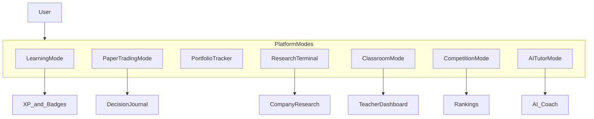
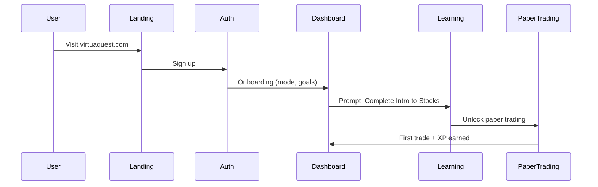

# VirtuaQuest — Product Vision

**Related docs:** [01-FEATURES.md](./01-FEATURES.md) · [13-BUILD_PRIORITIES.md](./13-BUILD_PRIORITIES.md) · [14-DEVELOPMENT_CHECKLIST.md](./14-DEVELOPMENT_CHECKLIST.md)

---

## Mission Statement

VirtuaQuest teaches financial literacy through **simulation-first learning** with AI mentorship. The platform helps users understand money, investing, markets, businesses, and financial decision-making — without encouraging excessive trading or speculation.

Users learn by doing: paper trading, portfolio building, company research, and guided lessons — not by reading alone.

---

## Product Vision

Combine the best of:

| Inspiration | What We Take |
|-------------|--------------|
| Bloomberg Terminal | Professional research density (Professional mode) |
| TradingView | Interactive charts and technical analysis |
| Robinhood Paper Trading | Accessible simulated trading UX |
| Yahoo Finance | Company pages and market overview |
| Morningstar | Fundamental analysis framing |
| Khan Academy | Structured courses and progress |
| Duolingo | Gamification, streaks, skill trees |
| Notion | Clean information architecture |
| ChatGPT | AI tutor and research assistant |
| Discord | Community and competitions |

Into one platform for beginners, students, educators, and aspiring investors.

---

## Tagline & Brand

- **Name:** VirtuaQuest
- **Tagline:** Learn money. Simulate markets. Master decisions.
- **Voice:** Clear, encouraging, educational — never hype-driven or speculative

---

## Non-Negotiable Product Principles

1. **Education over engagement hacks** — Gamification serves learning outcomes, not dopamine loops.
2. **Paper-only by default** — No real brokerage in MVP. Every trading screen displays "Simulated money — for education only."
3. **Explain before execute** — Progressive disclosure unlocks advanced tools after micro-lessons.
4. **Experience-level modes** — Beginner, Student, and Professional interfaces with appropriate vocabulary and density.
5. **Decision journaling** — Trades prompt reflective "why?" entries to build thoughtful habits.
6. **AI as teacher, not tipster** — AI refuses buy/sell recommendations; teaches frameworks (DCF, diversification, risk).

---

## Target Users & Personas

### Primary Personas (MVP)

#### Alex — High School Student (16)
- **Goal:** Win finance club competitions, learn investing basics
- **Needs:** Paper trading, leaderboards, simple explanations, gamification
- **Mode:** Student
- **Key features:** Dashboard, paper trading, learning module, leaderboards, AI tutor

#### Jordan — First-Time Investor (28)
- **Goal:** Understand stocks and build confidence before real investing
- **Needs:** AI tutor, company pages, portfolio tracker, jargon-free explanations
- **Mode:** Beginner → Student
- **Key features:** Company pages, AI chat, learning courses, portfolio

#### Ms. Chen — Finance Teacher
- **Goal:** Assign lessons and track student progress
- **Needs:** Classroom mode, assignments, progress dashboards
- **Mode:** Professional (teacher role)
- **Key features:** Classroom dashboard `[Future/P2]`, course management `[P1 admin]`

#### Parent Pat
- **Goal:** Monitor child's financial learning (not trading performance)
- **Needs:** Linked child account, progress view, safety controls
- **Mode:** Parent role
- **Key features:** Parent link `[P1]`, learning progress visibility

### Secondary Personas

| Persona | Age | Mode | Priority Features |
|---------|-----|------|-------------------|
| Kid (12+) | 12–15 | Beginner | Glossary tooltips, simplified UI, parental consent |
| College student | 18–22 | Student | Competitions, research terminal, internships prep |
| Finance club member | 16–22 | Student | Competitions, leaderboards, group portfolios |
| Aspiring professional | 23+ | Professional | Research terminal, advanced charts, SEC filings |
| Long-term investor | 30+ | Professional | Portfolio analytics, fundamental analysis, retirement tools `[P2]` |

---

## Experience-Level Modes

Three UI/UX tiers adapt vocabulary, density, and unlocked features.

| Mode | Audience | UI Density | Vocabulary | Unlocked by Default |
|------|----------|------------|------------|---------------------|
| **Beginner** | Ages 12+, first-time learners | Spacious, large type, guided | Plain language, glossary on every term | Learning, basic dashboard, paper trading (after intro lesson) |
| **Student** | High school, college | Balanced | Standard finance terms with tooltips | Full dashboard, competitions, screeners `[P1]` |
| **Professional** | Adults, advanced learners | Compact, terminal-style option | Full financial terminology | Research terminal, advanced TA, multi-panel layouts `[P1]` |

### Mode Selection

- Set at registration based on age and self-reported experience
- Changeable in Settings at any time
- AI responses adapt to active mode automatically

---

## Platform Modes (7)

| Mode | Description | Primary User | Priority |
|------|-------------|--------------|----------|
| **Learning Mode** | Courses, lessons, quizzes, skill trees | All | `[MVP]` |
| **Paper Trading Mode** | Simulated buy/sell with virtual wallet | Students, beginners | `[MVP]` |
| **Portfolio Tracker** | Holdings, allocation, performance | All | `[MVP]` |
| **AI Tutor Mode** | Chat-based financial coaching | All | `[MVP]` |
| **Research Terminal** | Multi-panel Bloomberg-style research | Professional mode users | `[P1]` |
| **Competition Mode** | Tournaments, seasons, school leagues | Students, clubs | `[P1]` |
| **Classroom Mode** | Teacher assignments, roster, progress | Educators | `[Future/P2]` |

---

## User Journeys

### Journey 1: New User → First Paper Trade `[MVP]`

**Steps:**
1. Land on marketing page → sign up with email or OAuth
2. Select experience level (Beginner / Student / Professional)
3. Set financial goals (optional)
4. Dashboard shows "Start here: Intro to Stocks" course
5. Complete Lesson 1 (what is a stock?) → unlock paper trading
6. Place first simulated market order → earn "First Trade" badge + XP
7. Prompted for decision journal entry ("Why did you buy?")

### Journey 2: Research a Company → Learn → Trade `[MVP]`

1. Search symbol (e.g., AAPL) from global search bar
2. View company overview, financials, chart
3. Hover terms for glossary definitions
4. Ask AI Tutor: "Explain Apple's business model"
5. Navigate to paper trading from company page
6. Buy fractional shares → portfolio updates via WebSocket

### Journey 3: Compete in Weekly Challenge `[P1]`

1. Join weekly investment tournament from dashboard
2. Receive $100K simulated portfolio scoped to competition
3. Trade during competition window
4. View live leaderboard (return %, not dollar amounts)
5. Competition ends → rankings frozen, badges awarded
6. AI Portfolio Review summarizes decisions (educational)

### Journey 4: Teacher Assigns Course `[Future/P2]`

1. Teacher creates classroom, invites students via code
2. Assigns "Personal Finance 101" Module 2 due Friday
3. Students complete lessons; teacher sees progress heatmap
4. Export completion report (FERPA-compliant)

---

## What VirtuaQuest Is NOT

- **Not a brokerage** — No real money, no real order routing
- **Not financial advice** — Educational simulation only; disclaimers on every financial screen
- **Not a stock tip service** — AI will not recommend specific buys or sells
- **Not a get-rich-quick platform** — Messaging emphasizes long-term learning and risk awareness

---

## Success Metrics (Product, Not Timeline)

| Metric | Target Direction |
|--------|------------------|
| First lesson completion rate | Increase |
| First paper trade rate (post-lesson) | Increase |
| 7-day retention | Increase |
| Learning XP vs trading XP ratio | Learning ≥ 60% of total XP |
| AI tutor sessions per active user | Increase (engagement with education) |
| NPS (students and teachers) | > 40 at beta |

---

## Business Model (Context)

| Tier | Price | Includes |
|------|-------|----------|
| **Free** | $0 | Learning, 1 portfolio, delayed data, basic AI tutor |
| **Student Plus** | $4.99/mo | Unlimited AI, competitions, advanced charts |
| **Teacher Pro** | $19.99/mo | Classroom mode, 150 students, assignment builder |
| **School License** | Custom | SSO, admin analytics, FERPA-compliant hosting |

Pricing is context for feature gating; implementation of billing is `[P1]` or later.

---

## Glossary of Internal Terms

| Term | Definition |
|------|------------|
| **Simulated money** | Virtual currency in paper trading; no real value |
| **Pillar** | One of 10 MVP deliverables |
| **Experience mode** | Beginner / Student / Professional UI tier |
| **Platform mode** | Learning / Paper Trading / Portfolio / etc. |
| **Decision journal** | User-written rationale attached to trades |
| **Progressive disclosure** | Features unlock after completing prerequisite lessons |
