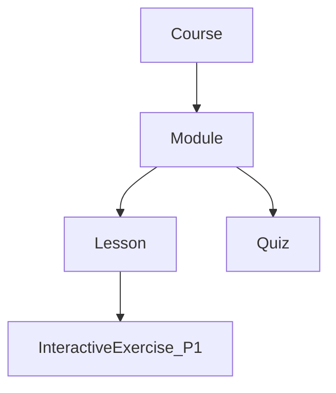

# VirtuaQuest — Learning & Gamification

**Related docs:** [01-FEATURES.md](./01-FEATURES.md) · [05-AI_SYSTEM.md](./05-AI_SYSTEM.md) · [07-UI_UX.md](./07-UI_UX.md)

---

## 1. Learning Philosophy

Every interaction on VirtuaQuest should teach. The learning system is not a separate silo — it integrates with trading, research, and AI through:

- **Universal glossary tooltips** on financial terms
- **Progressive disclosure** — features unlock after prerequisite lessons
- **Decision journaling** — trades require reflective writing
- **XP for learning actions** — learning XP weighted higher than trading XP in level calculation

---

## 2. Universal Glossary Tooltip `[MVP]`

**Description:** Hover (desktop) or long-press (mobile) any underlined financial term to see an educational popover.

### Popover Content (all fields)

| Field | Description |
|-------|-------------|
| **Definition** | One-sentence precise definition |
| **Importance** | Why this matters to investors |
| **Formula** | If applicable (e.g., P/E = Price / EPS) |
| **Real-world Example** | Concrete example with a known company |
| **Beginner Explanation** | Plain language, no jargon |
| **Advanced Explanation** | Technical depth for Professional mode |
| **Related Concepts** | Links to 2–4 related glossary terms |
| **Mini Quiz** | One multiple-choice question |

**User Story:** *As a beginner, I want to understand any financial term instantly, so that I don't get stuck reading lessons or company pages.*

**Acceptance Criteria:**
- [ ] Terms auto-detected in lessons, company pages, news, AI responses
- [ ] Popover opens in <200ms
- [ ] Mini quiz awards +5 XP on correct answer
- [ ] "Learn more" links to full dictionary entry
- [ ] Works in dark and light mode

**API:** `GET /glossary/:slug`  
**Tables:** `glossary_terms`, `glossary_term_relations`, `glossary_quizzes`

### Sample Glossary Entry: `price-to-earnings-ratio`

```json
{
  "slug": "price-to-earnings-ratio",
  "term": "P/E Ratio",
  "definition": "Stock price divided by earnings per share.",
  "formula": "P/E = Share Price / EPS",
  "importance": "Helps compare if a stock is expensive or cheap relative to earnings.",
  "beginner_explanation": "If a stock costs $100 and the company earns $5 per share, the P/E is 20. You pay $20 for every $1 of earnings.",
  "advanced_explanation": "Trailing P/E uses past EPS; forward P/E uses analyst estimates. Compare within same sector.",
  "related_slugs": ["earnings-per-share", "valuation", "price-to-book-ratio"]
}
```

---

## 3. Finance Dictionary `[MVP]`

**Description:** Searchable A–Z dictionary of 500+ terms at launch (MVP: 100 core terms).

**Acceptance Criteria:**
- [ ] Browse alphabetically and search
- [ ] Each entry matches glossary tooltip schema
- [ ] Bookmark terms `[P1]`

**API:** `GET /glossary?q=`  
**Route:** `/learn/dictionary`

---

## 4. Course Structure



| Entity | Description | MVP |
|--------|-------------|-----|
| **Course** | Top-level program (e.g., Intro to Stocks) | 3 courses |
| **Module** | Thematic chapter (3–5 per course) | Yes |
| **Lesson** | 5–15 min reading/video/interactive unit | Yes |
| **Quiz** | 5–10 questions per module | Yes |
| **Learning Path** | Curated sequence across courses | `[P1]` |
| **Certificate** | PDF on course completion | `[P1]` |

---

## 5. MVP Courses (Seed Content)

### Course 1: Personal Finance 101 `[MVP]`

| Module | Lessons | Unlocks |
|--------|---------|---------|
| Money Basics | Budgeting, Saving, Compound Interest | Dashboard widgets |
| Banking & Credit | Accounts, Credit scores, Debt | — |
| Goals & Planning | Emergency fund, SMART goals | Goals widget `[P1]` |

### Course 2: Intro to Stocks `[MVP]`

| Module | Lessons | Unlocks |
|--------|---------|---------|
| What is a Stock? | Ownership, IPOs, Tickers | Company page access |
| How Markets Work | Exchanges, Hours, Orders | **Paper trading** |
| Your First Portfolio | Diversification, Index funds | Watchlist |

### Course 3: Risk & Diversification `[MVP]`

| Module | Lessons | Unlocks |
|--------|---------|---------|
| Understanding Risk | Volatility, Beta, Risk tolerance | Risk score widget `[P1]` |
| Diversification | Sectors, Asset classes, ETFs | Sector allocation view `[P1]` |
| Behavioral Finance | Fear, Greed, Common mistakes | Decision journal emphasis |

**Acceptance Criteria:**
- [ ] Each lesson: title, body (markdown), estimated time, XP reward
- [ ] Quiz pass threshold: 70%
- [ ] Failed quiz allows retake after 1 hour
- [ ] Course progress persisted per user

**API:** `GET /courses`, `GET /courses/:id`, `GET /lessons/:id`, `POST /lessons/:id/complete`, `POST /quizzes/:id/submit`  
**Tables:** `courses`, `modules`, `lessons`, `quizzes`, `quiz_questions`, `quiz_attempts`, `enrollments`, `lesson_completions`

---

## 6. Interactive Exercises `[P1]`

| Type | Description |
|------|-------------|
| Chart annotation | Mark support/resistance on historical chart |
| Portfolio builder | Allocate $10K across assets to meet risk target |
| Statement reader | Identify line items on income statement |
| What-if calculator | Change assumptions in compound interest sim |
| Matching | Match terms to definitions |

**Acceptance Criteria:**
- [ ] Exercise completion awards XP
- [ ] Immediate feedback on wrong answers
- [ ] AI hint button (uses tutor, counts toward rate limit)

---

## 7. Flashcards `[P1]`

**Description:** Spaced repetition (SM-2 algorithm) for glossary and course terms.

**Acceptance Criteria:**
- [ ] Front/back card UI with flip animation
- [ ] "Again / Good / Easy" rating adjusts interval
- [ ] Daily review queue on dashboard
- [ ] AI-generated flashcards from completed lessons `[P1]`

**API:** `GET /flashcards/due`, `POST /flashcards/:id/review`  
**Tables:** `flashcards`, `flashcard_reviews`

---

## 8. Skill Trees `[P1]`

**Description:** Duolingo-style visual tree showing locked/unlocked/completed nodes.

**Nodes:**
- Course modules as branches
- Special nodes: First Trade, Diversified Portfolio, Quiz Master
- Locked nodes show prerequisite

**Acceptance Criteria:**
- [ ] Visual tree on `/learn` page
- [ ] Completed nodes: green check; current: highlighted; locked: gray
- [ ] Click node navigates to lesson or shows lock reason

---

## 9. Gamification System

### 9.1 XP (Experience Points)

| Action | XP | Priority |
|--------|-----|----------|
| Complete lesson | 25 | `[MVP]` |
| Pass quiz | 50 | `[MVP]` |
| Daily challenge correct | 15 | `[P1]` |
| Glossary mini quiz correct | 5 | `[MVP]` |
| First trade of day | 10 | `[P1]` |
| Decision journal entry | 15 | `[MVP]` |
| 7-day streak bonus | 100 | `[P1]` |
| Course completion | 200 | `[MVP]` |

**Level formula:** `level = floor(sqrt(total_xp / 100))` — levels 1–100 cap at 1,000,000 XP.

**Learning vs Trading XP:** Display both separately; level uses `learning_xp * 0.6 + trading_xp * 0.4` to weight education.

**API:** `GET /users/me/xp`, internal `xp_events` on actions  
**Tables:** `xp_events`, `user_profiles.total_xp`, `user_profiles.level`

---

### 9.2 Levels & Titles `[MVP]` basic / `[P1]` full

| Level Range | Title |
|-------------|-------|
| 1–5 | Budget Builder |
| 6–15 | Market Explorer |
| 16–30 | Portfolio Architect |
| 31–50 | Market Scholar |
| 51–75 | Finance Strategist |
| 76–100 | VirtuaQuest Master |

---

### 9.3 Badges & Achievements

**MVP badges (10 minimum):**

| Badge | Trigger |
|-------|---------|
| First Steps | Complete registration + onboarding |
| Bookworm | Complete first lesson |
| Quiz Whiz | Pass first quiz |
| First Trade | Execute first paper trade |
| Journaler | Write first decision journal entry |
| Diversifier | Hold 3+ different symbols |
| Streak Starter | 3-day login streak |
| Course Graduate | Complete any full course |
| Curious Mind | Ask AI tutor 5 questions |
| Explorer | View 10 company pages |

**P1 badges (40+ additional):** sector specialist, competition winner, perfect quiz score, etc.

**Acceptance Criteria:**
- [ ] Badge earned triggers notification + profile display
- [ ] Badge detail page: name, description, earned date, rarity
- [ ] Hidden badges for surprises `[P1]`

**Tables:** `achievements`, `user_achievements`

---

### 9.4 Coins & Unlockables `[P1]`

**Description:** Cosmetic currency earned from XP milestones — **no pay-to-win**.

**Spend on:**
- Profile themes
- Avatar frames
- Chart color schemes
- Title flair

**Acceptance Criteria:**
- [ ] Coins cannot buy trading advantages or real money
- [ ] Shop UI at `/profile/shop`

---

### 9.5 Daily Streak `[P1]`

**Rules:**
- Streak increments on login + complete daily challenge OR one learning action
- Miss one day: streak resets (streak freeze item `[P1]` cosmetic shop)

---

### 9.6 Weekly Missions & Monthly Challenges `[P1]`

| Type | Example |
|------|---------|
| Weekly mission | Complete 3 lessons this week |
| Monthly season | Themed challenge (e.g., "Dividend February") with cosmetic reward |

**Acceptance Criteria:**
- [ ] Mission progress on dashboard
- [ ] Season leaderboard separate from all-time `[P1]`

---

## 10. Leaderboards

See [01-FEATURES.md](./01-FEATURES.md) §9. Detailed rules:

### Best Investors
- Ranked by **simulated portfolio return %** over rolling 30 days (MVP: all-time)
- Minimum 5 trades to qualify
- Dollar amounts never shown on public leaderboard

### Best Learners
- Ranked by total XP (learning XP only option `[P1]`)

### Scopes

| Scope | Priority | Requirement |
|-------|----------|-------------|
| Global | `[MVP]` | None |
| Friends | `[P1]` | Mutual follow |
| Weekly / Monthly / All-Time | `[P1]` | Time filter |
| Country / State | `[P1]` | Profile country |
| School / University | `[P1]` | Verified email domain |
| Most Consistent | `[P2]` | Streak length |
| Lowest Risk | `[P2]` | Beta of portfolio |
| Highest Growth | `[P2]` | Return % with min trades |

**Implementation:** Materialized view refreshed every 5 min; Redis cache for top 100.

**API:** `GET /leaderboards?type=&scope=&period=`  
**Tables:** `leaderboard_snapshots`

---

## 11. Daily Challenges `[P1]`

**Description:** One question per day (quiz or scenario); 2-minute completion target.

**Acceptance Criteria:**
- [ ] New challenge at midnight UTC
- [ ] +15 XP for correct answer
- [ ] Streak counts toward daily streak
- [ ] Share result (optional) `[P1]`

**Tables:** `daily_challenges`, `daily_challenge_attempts`

---

## 12. Learning Analytics (Teacher/Admin) `[P1]`

**Metrics:**
- Lesson completion rate per course
- Average quiz score
- Time on platform
- Learning vs trading XP ratio

**Audience:** Admin panel; teacher dashboard `[Future/P2]`

---

## 13. AI Learning Features

| Feature | Priority | Doc |
|---------|----------|-----|
| AI Daily Lesson | `[P1]` | [05-AI_SYSTEM.md](./05-AI_SYSTEM.md) |
| AI Quiz Generator | `[P1]` | [05-AI_SYSTEM.md](./05-AI_SYSTEM.md) |
| AI Flashcards | `[P1]` | [05-AI_SYSTEM.md](./05-AI_SYSTEM.md) |
| Explain Like I'm 10 / Beginner / Expert | `[MVP]` Beginner / `[P1]` all | [05-AI_SYSTEM.md](./05-AI_SYSTEM.md) |

---

## 14. Progressive Disclosure Matrix

| Feature | Prerequisite |
|---------|--------------|
| Paper trading | Complete Intro to Stocks → Module 2 → Lesson 1 |
| Limit orders | Complete Intro to Stocks full course |
| Stop orders | Complete Risk & Diversification → Module 1 |
| Stock screener | Complete Intro to Stocks + 5 trades |
| Research terminal | Professional mode + 2 courses complete |
| Competitions | Complete Personal Finance 101 |

Configurable by admin in `[P1]`.
