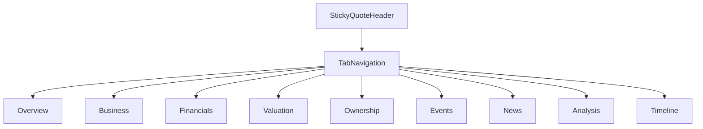
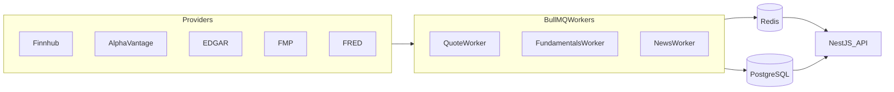

# VirtuaQuest — Company Pages & Market Data

**Related docs:** [04-TRADING_TOOLS.md](./04-TRADING_TOOLS.md) · [05-AI_SYSTEM.md](./05-AI_SYSTEM.md) · [08-ARCHITECTURE.md](./08-ARCHITECTURE.md)

---

## 1. Market Data Strategy

### 1.1 Free-Tier Sources (MVP)

| Data Type | Provider | Rate Limits | Cache TTL |
|-----------|----------|-------------|-----------|
| US stock quotes | Finnhub (primary), Alpha Vantage (fallback) | 60/min, 25/day AV | 60s Redis |
| Historical OHLCV | Alpha Vantage, Yahoo (backup) | AV rate limits | 24h Postgres |
| Fundamentals | SEC EDGAR + FMP free | FMP 250/day | 7d Postgres |
| Economic data | FRED API | Generous | 24h |
| News | Finnhub + RSS | Limited | 15min |
| Indices | Finnhub / Alpha Vantage | Shared limits | 60s |
| ETF metadata | FMP / manual seed | Limited | 7d |

**MVP behavior:** 15-minute delayed quotes acceptable. Label all prices: "Delayed 15 min — for education."

### 1.2 MarketDataProvider Interface

All consumers use abstraction — never call providers directly from UI.

```typescript
interface MarketDataProvider {
  getQuote(symbol: string): Promise<Quote>;
  getHistorical(symbol: string, interval: Interval, range: Range): Promise<OHLCV[]>;
  getFundamentals(symbol: string): Promise<Fundamentals>;
  searchSymbols(query: string): Promise<SymbolSearchResult[]>;
}
```

Implementations: `FinnhubProvider`, `AlphaVantageProvider`, `CachedProvider` (decorator).

### 1.3 Upgrade Path

| Tier | Provider | Unlocks |
|------|----------|---------|
| Free (MVP) | Finnhub + AV + EDGAR | Delayed quotes, daily bars |
| Tier 2 | Polygon.io Starter | Real-time US equities, intraday |
| Tier 3 | Polygon + Benzinga | Real-time news, earnings transcripts |
| Tier 4 | Enterprise (FactSet/Refinitiv) | Institutional terminal parity |

---

## 2. Complete Company Page

**Route:** `/company/:symbol`

**Layout:** Sticky quote header + tabbed content + sidebar quick stats



### 2.1 Tab: Overview `[MVP]`

| Section | Fields | Priority |
|---------|--------|----------|
| Quote | Price, change $/%, volume, market cap | `[MVP]` |
| Key stats | P/E, EPS, dividend yield, 52-week range, beta | `[MVP]` |
| Description | Business summary (2–3 paragraphs) | `[MVP]` |
| Sector / Industry | GICS classification | `[MVP]` |
| Quick chart | 1Y line chart embed | `[MVP]` |
| Actions | Add to watchlist, Trade, Ask AI | `[MVP]` |

---

### 2.2 Tab: Business `[P1]`

| Section | Content |
|---------|---------|
| Business Model | How the company makes money (diagram) |
| Products | Product lines with revenue % where available |
| Services | Service offerings |
| Competitive Advantages | Moat factors |
| Competitors | Peer list with links |
| CEO & Leadership | Name, title, tenure, brief bio |
| Employees | Headcount, trend |
| Headquarters | City, country, map link |
| Website | External link |
| Investor Relations | IR page link |

---

### 2.3 Tab: Financials

#### Key Metrics Grid

| Metric | Priority |
|--------|----------|
| Stock Price, Market Cap, Enterprise Value | MVP / P1 |
| Revenue, Revenue Growth, Net Income, EPS | `[MVP]` |
| P/E, PEG, P/B, P/S | P1 |
| ROE, ROA, ROIC | `[P1]` |
| Gross, Operating, Profit Margin | `[MVP]` |
| Cash, Debt, Free Cash Flow | MVP / P1 |
| Dividend, Dividend Yield | `[P1]` |
| Beta, CAGR, Shares Outstanding | `[P1]` |

#### Financial Statements

| Statement | Periods | Priority |
|-----------|---------|----------|
| Income Statement | Annual | `[MVP]` |
| Balance Sheet | Annual | `[MVP]` |
| Cash Flow Statement | Annual | `[MVP]` |
| Quarterly (all three) | Quarterly | `[P1]` |
| Historical (5–10 year) | Annual | `[P1]` |

**Display:** Table with toggle annual/quarterly; export CSV `[P1]`

#### Reports & Filings `[P1]`

- Annual reports (10-K links)
- Quarterly reports (10-Q links)
- SEC filings list with dates
- Earnings reports
- Investor presentations (PDF links)
- Conference calls (audio/transcript `[P2]`)

**Data source:** SEC EDGAR API for filings; FMP for structured statements.

---

### 2.4 Tab: Valuation `[P1]`

| Section | Description |
|---------|-------------|
| Valuation Summary | Current vs historical P/E, P/S bands |
| DCF Calculator | Educational — user adjusts growth rate, WACC |
| Comparables | Table vs 3–5 peers |
| Historical Multiples Chart | 5-year P/E trend |

---

### 2.5 Tab: Ownership `[P1]`

| Section | Source |
|---------|--------|
| Insider Trading | Recent Form 4 transactions |
| Institutional Holdings | 13F aggregated (lagged) |
| Ownership Breakdown | Insiders / institutions / public float |

---

### 2.6 Tab: Events `[P1]`

| Section | Content |
|---------|---------|
| Earnings History | Date, EPS est/actual, surprise |
| Dividend History | Ex-date, amount, yield |
| Stock Splits | Date, ratio |
| Upcoming Events | Next earnings date |

---

### 2.7 Tab: News `[P1]`

| Feature | Priority |
|---------|----------|
| Company-specific news feed | `[P1]` |
| AI News Summary | `[P1]` |
| Sentiment indicator (educational) | `[P1]` |

---

### 2.8 Tab: Analysis `[P1]`

| Section | Source |
|---------|--------|
| SWOT | AI-generated from filings + user edit disabled |
| Business Model Canvas | Structured summary |
| Economic Moat | AI score 1–5 with explanation |
| Bull Case | AI-generated, cited |
| Bear Case | AI-generated, cited |
| Risk Analysis | From 10-K risk factors |
| Growth Analysis | Revenue/earnings trends |
| Dividend Analysis | Payout ratio, history, sustainability |
| ESG Summary | Basic scores where available |

**Disclaimer on tab:** "AI-generated analysis for education only. Not investment advice."

---

### 2.9 Tab: Timeline `[P1]`

**Description:** Company history milestones — founding, IPO, major products, acquisitions.

**Data:** Manual seed for top 500 symbols; AI-assisted for others `[P1]`.

---

## 3. Market Data — Asset Classes

### 3.1 MVP

| Asset | Display | Paper Trade |
|-------|---------|-------------|
| US Stocks | Yes | Yes |
| S&P 500, NASDAQ, Dow Jones | Index tickers | No |

### 3.2 P1 (Display-Only Unless Noted)

| Asset | Notes |
|-------|-------|
| Russell 2000 | Index |
| Global markets | Major indices (FTSE, DAX, Nikkei) |
| ETFs | Display + paper trade |
| Mutual Funds | Display only (NAV delayed) |
| Bonds | Treasury yields, corporate bond indices |
| Treasuries | Yield curve |
| Commodities | Gold, Silver, Oil, Natural Gas |
| Forex | Major pairs |
| Bitcoin, Ethereum | Display only |
| Fear & Greed Index | CNN or alternative API |
| VIX | CBOE volatility index |
| REITs | As stocks |

### 3.3 P2 / Future

| Asset | Notes |
|-------|-------|
| Futures | Educational display |
| Options | Educational display + chain `[Future]` |
| Crypto trading sim | `[Future]` |

---

## 4. Market Calendars

| Calendar | Priority | Data Source |
|----------|----------|-------------|
| Earnings Calendar | `[P1]` | Finnhub |
| Economic Calendar | `[P1]` | FRED + Finnhub |
| IPO Calendar | `[P2]` | Finnhub |
| Dividend Calendar | `[P2]` | FMP |
| Stock Split Calendar | `[P2]` | FMP |
| Federal Reserve Calendar | `[P2]` | Manual seed + FRED |

**UI:** `/markets/calendar` with filter by type and date range.

**Acceptance Criteria:**
- [ ] Week/month view
- [ ] Click event → company page or economic indicator detail
- [ ] Add to personal calendar export `.ics` `[P1]`

**API:** `GET /calendars/:type?from=&to=`  
**Tables:** `calendar_events` (cached)

---

## 5. Screeners

### 5.1 Stock Screener `[P1]`

**Filters (minimum):**
- Sector, Industry
- Market cap range
- P/E range
- Dividend yield
- Revenue growth YoY
- Country

**Acceptance Criteria:**
- [ ] Results table: symbol, name, price, key metric
- [ ] Save screen with name
- [ ] "Explain this screen" AI button
- [ ] Export CSV

### 5.2 Additional Screeners `[P2]`

| Screener | Key Filters |
|----------|-------------|
| ETF | Expense ratio, AUM, category, yield |
| Dividend | Yield, payout ratio, growth streak |
| Growth | Revenue growth, EPS growth |
| Value | P/E, P/B, P/S below sector median |
| Sector | All stocks in sector ranked |
| Country | By exchange/country |
| Custom | User combines any filters |

**API:** `POST /screeners/run`, `GET/POST /screeners/saved`  
**Tables:** `saved_screeners`, `screener_results` (cache)

---

## 6. News System `[P1]`

| Feed | Scope |
|------|-------|
| Global Market News | Top financial headlines |
| Company News | Per symbol on company page |
| Earnings News | Tagged earnings-related |
| Economic News | Macro, Fed, GDP |
| Breaking News | High-priority flag |
| Personalized Feed | Based on watchlist + portfolio |
| AI News Summary | Per article and daily digest |

**Acceptance Criteria:**
- [ ] News list with source, headline, time, thumbnail
- [ ] AI summary: 3 bullet points + link to source
- [ ] Personalization uses watchlist symbols

**API:** `GET /news?scope=global|portfolio|symbol&symbol=`  
**Tables:** `news_articles`, `news_summaries`

---

## 7. Economic Data `[P1]`

**Indicators (FRED):**
- GDP, CPI (inflation), Unemployment
- Federal Funds Rate
- Consumer Confidence
- 10-Year Treasury Yield

**UI:** `/markets/economy` dashboard with charts and AI explainer.

---

## 8. Search

**Global search supports:**
- Symbols (AAPL, SPY)
- Company names (Apple)
- `[P1]` Courses, glossary terms, news headlines

**Acceptance Criteria:**
- [ ] Results in <300ms (Typesense)
- [ ] Recent searches stored locally
- [ ] Keyboard navigation in dropdown

**API:** `GET /search?q=&type=`

---

## 9. Data Ingestion Architecture



**Jobs:**
- `sync-quotes`: every 60s for watchlist + index symbols
- `sync-fundamentals`: daily for active company pages
- `sync-news`: every 15 min
- `sync-edgar`: daily for filing metadata

---

## 10. Error & Stale Data Handling

| Condition | UX |
|-----------|------|
| Provider down | Show cached data + "Last updated X min ago" banner |
| Symbol not found | 404 with search suggestion |
| Rate limit hit | Serve cache; queue retry |
| Stale >30 min | Yellow warning banner on quote header |

**Monitoring:** Alert if quote staleness >30 min for >5% of watchlist symbols.
