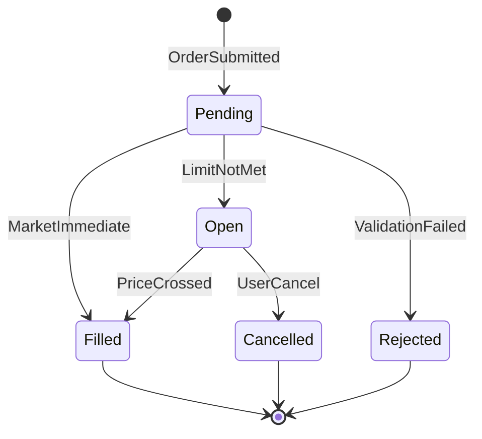

# VirtuaQuest — Trading Tools

**Related docs:** [01-FEATURES.md](./01-FEATURES.md) · [03-COMPANY_MARKET_DATA.md](./03-COMPANY_MARKET_DATA.md) · [10-API.md](./10-API.md)

---

## 1. Paper Trading Engine

### 1.1 Overview

VirtuaQuest paper trading simulates equity orders against delayed market quotes. No real money, no broker integration, no order routing to exchanges.

**Labeling:** Persistent banner: "Simulated trading — educational purposes only. Not connected to any brokerage."

### 1.2 Virtual Wallet `[MVP]`

| Field | Description |
|-------|-------------|
| `cash_balance` | Uninvested simulated cash |
| `starting_capital` | Initial deposit (user-selected) |
| `total_value` | cash + sum(position market values) |
| `buying_power` | cash_balance (no margin MVP) |

**Starting capital options:** $10,000 | $50,000 | $100,000 (default) | $500,000

Set once at portfolio creation; not changeable without reset `[P1]`.

---

### 1.3 Order Types

| Type | Priority | Behavior |
|------|----------|----------|
| **Market** | `[MVP]` | Fill at next available quote (ask for buy, bid for sell) |
| **Limit** | `[P1]` | Fill when quote crosses limit price; GTC until cancelled |
| **Stop** | `[P1]` | Triggers market order when stop price hit |
| **Stop-Limit** | `[P2]` | Triggers limit order at stop price |

**Fractional shares:** Supported to 4 decimal places `[MVP]`.

**Fees & commissions:** $0 (simulated); display "Commission: $0.00 (simulated)"

---

### 1.4 Order Lifecycle

**Validation rules:**
- Sufficient cash for buys
- Sufficient shares for sells
- Symbol exists and is tradable (US equities MVP)
- Quantity > 0
- Limit/stop prices > 0

**Reject reasons (user-facing):**
- `INSUFFICIENT_FUNDS`
- `INSUFFICIENT_SHARES`
- `INVALID_SYMBOL`
- `MARKET_CLOSED` (informational; MVP still fills at last quote with notice)

---

### 1.5 Trade Confirmation `[MVP]`

Modal before submit:
- Symbol, company name, side (Buy/Sell)
- Quantity, order type, estimated price
- Estimated total
- Checkbox: "I understand this is simulated"
- Optional: Decision journal text area (required if total > $1,000)

---

### 1.6 Transaction & Order History `[MVP]`

| View | Columns |
|------|---------|
| Orders | Date, symbol, side, type, qty, price, status |
| Transactions | Date, symbol, side, qty, fill price, total |

Filters: symbol, date range, side, status. Pagination: 20 per page.

---

### 1.7 Real-Time Portfolio Updates `[MVP]`

- WebSocket event `portfolio:update` on fill
- Payload: `{ portfolioId, cash, totalValue, positions[] }`
- Client updates dashboard and portfolio without full page reload
- Quote prices: polling every 60s on open pages (delayed data)

---

### 1.8 Decision Journal `[MVP]`

**Trigger:** Orders with estimated value > $1,000 simulated.

**Fields:**
- `trade_id` (FK to transaction)
- `rationale` (text, 10–500 chars)
- `thesis_tags` (optional: growth, value, dividend, momentum) `[P1]`

**XP:** +15 XP per journal entry.

**AI Journal Coach `[P1]`:** Weekly review of entries via AI (Socratic questions, not grades).

---

## 2. Portfolio Analytics

### 2.1 Holdings View `[MVP]`

| Column | Description |
|--------|-------------|
| Symbol | Ticker + link to company page |
| Name | Company name |
| Quantity | Shares held |
| Avg Cost | Weighted average purchase price |
| Current Price | Latest quote |
| Market Value | qty × price |
| Unrealized G/L | $ and % |
| Weight | % of portfolio |

---

### 2.2 Allocation Views

| View | Priority | Chart Type |
|------|----------|------------|
| By holding | `[MVP]` | Donut |
| By sector | `[P1]` | Donut + bar |
| By country | `[P1]` | Map or bar |
| By asset class | `[P1]` | Stacked bar (stocks, cash, ETFs) |

---

### 2.3 Performance `[P1]`

| Metric | Calculation |
|--------|-------------|
| Total return | (current value - starting capital) / starting capital |
| Daily return | Change since previous close |
| Realized G/L | Sum from closed positions |
| Unrealized G/L | Sum from open positions |
| Benchmark comparison | vs SPY same period |

**Portfolio chart:** Line chart of total value over time (daily snapshots).

---

### 2.4 Advanced Analytics `[P2]`

| Feature | Description |
|---------|-------------|
| Portfolio Replay | Scrub timeline to see historical holdings |
| Portfolio Heatmap | Grid colored by daily return per holding |
| Dividend History | Simulated dividends credited `[P1]` if FMP provides ex-dates |
| Risk metrics | Portfolio beta, std dev, Sharpe (educational) `[P1]` |

---

## 3. Watchlists `[MVP]`

- Default watchlist created on signup
- Add/remove from company page, search, dashboard
- Max 50 symbols per watchlist; 5 watchlists `[P1]`
- Display: symbol, price, change %, sparkline `[P1]`
- Drag to reorder `[P1]`

**API:** `GET/POST/PATCH/DELETE /watchlists`, `POST /watchlists/:id/items`  
**Tables:** `watchlists`, `watchlist_items`

---

## 4. Alerts `[P1]`

| Alert Type | Trigger |
|------------|---------|
| Price above | Quote >= threshold |
| Price below | Quote <= threshold |
| Earnings | 24h before earnings date |
| News | New article for symbol |

Delivery: in-app notification; email optional.

**Tables:** `alerts`

---

## 5. Charts

### 5.1 Chart Library

**Primary:** TradingView Lightweight Charts (OSS)  
**Secondary:** Recharts for portfolio/performance donuts and bar charts

### 5.2 Chart Types

| Type | Priority | Use Case |
|------|----------|----------|
| Line | `[MVP]` | Simple price history |
| Candlestick | `[MVP]` | OHLC on company/trade pages |
| Volume | `[MVP]` | Histogram below price chart |
| OHLC | `[P1]` | Bar-style OHLC |
| Portfolio value | `[P1]` | Account growth over time |
| Performance vs benchmark | `[P1]` | Two-line comparison |
| Comparison | `[P1]` | Multi-symbol normalized |
| Sector performance | `[P1]` | Sector ETF bars |

### 5.3 Interactivity `[MVP]`

- Zoom: scroll wheel / pinch
- Pan: drag
- Crosshair with OHLCV tooltip
- Time range buttons: 1D, 5D, 1M, 3M, 6M, 1Y, 5Y, MAX
- `[MVP]` Daily bars only; intraday `[P1]`

### 5.4 Drawing Tools `[P2]`

- Trend lines
- Horizontal lines (support/resistance)
- Fibonacci retracement
- Text annotations

Persist drawings per user per symbol in `chart_drawings` table.

---

## 6. Technical Analysis Indicators

### 6.1 P1 Indicators

| Indicator | Params (default) | Overlay/Separate |
|-----------|------------------|------------------|
| SMA | 20, 50, 200 | Overlay |
| EMA | 12, 26 | Overlay |
| RSI | 14 | Separate panel |
| MACD | 12, 26, 9 | Separate panel |
| VWAP | Session | Overlay (intraday P1) |
| Bollinger Bands | 20, 2 | Overlay |

**UI:** Indicator picker dropdown; enable/disable; parameter edit in advanced panel.

**Educational:** Each indicator has "What is this?" link to glossary + AI explain.

### 6.2 P2 Indicators

| Indicator | Notes |
|-----------|-------|
| ATR | Volatility |
| Fibonacci | Retracement levels |
| Ichimoku Cloud | Full cloud overlay |
| Stochastic Oscillator | Separate panel |
| ADX | Trend strength |
| CCI | Separate panel |
| OBV | On-balance volume |
| Volume Profile | Requires intraday data |

### 6.3 Support & Resistance `[P2]`

- Auto-detect levels from local min/max (educational algorithm)
- Manual override with drawing tools

---

## 7. Fundamental Analysis Tools `[P1]`

| Tool | Location | Description |
|------|----------|-------------|
| SWOT | Company → Analysis | AI-generated, cited |
| Business Model | Company → Business | Structured breakdown |
| Competitive Advantage | Company → Business | Moat narrative |
| Economic Moat | Company → Analysis | 1–5 score + factors |
| Bull / Bear Case | Company → Analysis | Side-by-side cards |
| Valuation Summary | Company → Valuation | Multiples vs history/peers |
| Risk Analysis | Company → Analysis | 10-K risk factors |
| Growth Analysis | Company → Analysis | Revenue/earnings CAGR |
| Dividend Analysis | Company → Analysis | Safety, growth, yield |
| Ownership Analysis | Company → Ownership | Insider/institutional trends |

---

## 8. Research Terminal `[P1]`

**Route:** `/terminal` (Professional mode default)

**Layout:** Multi-panel resizable grid (Bloomberg-inspired, simplified)

| Panel | Content |
|-------|---------|
| Watchlist | User watchlists with live quotes |
| Chart | Selected symbol candlestick + indicators |
| Order entry | Paper trade panel |
| News | Symbol or market news stream |
| Filings | Recent SEC filings for symbol |
| AI Research | Embedded AI assistant |

**Keyboard shortcuts:** See [07-UI_UX.md](./07-UI_UX.md)

---

## 9. Correlation & Heatmaps `[P2]`

| Tool | Description |
|------|-------------|
| Portfolio heatmap | Holdings × daily return grid |
| Sector heatmap | Sector ETFs color-coded by performance |
| Correlation matrix | Pairwise correlation of holdings (30-day) |

---

## 10. Backtesting `[Future]`

Educational strategy backtesting against historical data. Requires intraday/daily data tier upgrade. Not in MVP/P1/P2 scope.

---

## 11. Trading Business Rules Summary

| Rule | MVP Value |
|------|-----------|
| Asset classes | US equities, `[P1]` ETFs |
| Short selling | No |
| Margin | No |
| Options/futures | No (display only `[Future]`) |
| Dividends | Simulated credit `[P1]` |
| Stock splits | Auto-adjust positions `[P1]` |
| Commission | $0 |
| Slippage | None (fill at quote) |
| Market hours | Fill at last quote anytime (with educational notice) |

---

## 12. API Reference (Trading)

| Method | Endpoint | Priority |
|--------|----------|----------|
| GET | `/portfolios` | MVP |
| POST | `/portfolios` | MVP |
| GET | `/portfolios/:id` | MVP |
| GET | `/portfolios/:id/positions` | MVP |
| POST | `/portfolios/:id/orders` | MVP |
| GET | `/portfolios/:id/orders` | MVP |
| DELETE | `/portfolios/:id/orders/:orderId` | P1 |
| GET | `/portfolios/:id/transactions` | MVP |
| GET | `/portfolios/:id/performance` | P1 |
| POST | `/portfolios/:id/journal` | MVP |
| GET | `/quotes/:symbol` | MVP |
| GET | `/charts/:symbol?interval=&range=` | MVP |

Full spec: [10-API.md](./10-API.md)
