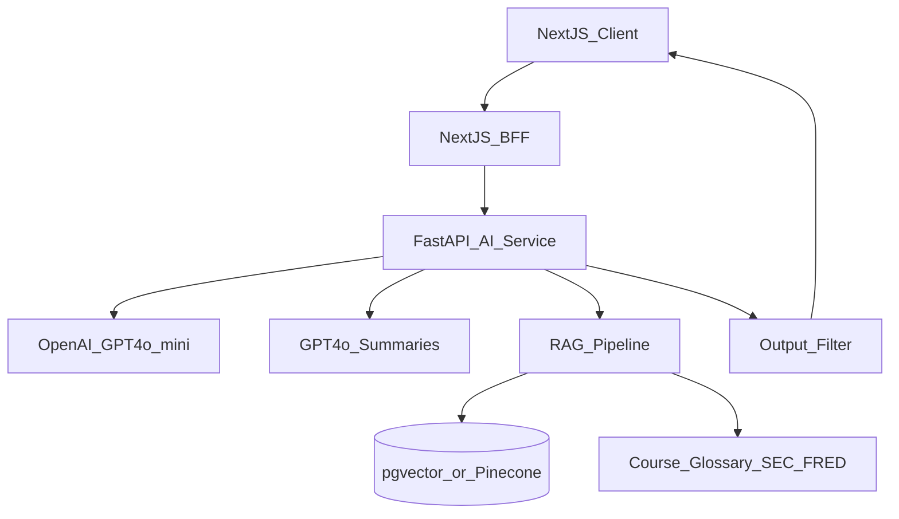

# VirtuaQuest — AI System

**Related docs:** [01-FEATURES.md](./01-FEATURES.md) · [02-LEARNING_GAMIFICATION.md](./02-LEARNING_GAMIFICATION.md) · [11-SECURITY_COMPLIANCE.md](./11-SECURITY_COMPLIANCE.md)

---

## 1. AI Philosophy

VirtuaQuest AI acts as **teacher, coach, and research assistant** — never as a stock tipster or financial advisor.

**Core rules (system prompt, all modes):**
1. Never recommend buying or selling specific securities
2. Never provide price targets or timing predictions
3. Always frame output as educational
4. Cite sources when summarizing filings or news
5. Adapt vocabulary to user's experience mode (Beginner / Student / Professional)
6. Include disclaimer when discussing financial decisions: "This is educational information, not financial advice."

---

## 2. Architecture



| Component | Technology |
|-----------|------------|
| AI service | Python FastAPI |
| Default model | GPT-4o-mini (chat, tutor, quiz) |
| Premium model | GPT-4o (filings, earnings, long summaries) |
| Embeddings | text-embedding-3-small |
| Vector store | pgvector in PostgreSQL (MVP) or Pinecone (scale) |
| Orchestration | LangChain or LlamaIndex |
| Rate limiting | Redis per user tier |

---

## 3. All 24 AI Features

| # | Feature | Priority | Description |
|---|---------|----------|-------------|
| 1 | AI Chat Assistant | `[MVP]` | General financial Q&A |
| 2 | AI Financial Tutor | `[MVP]` | Structured teaching mode |
| 3 | AI Investment Coach | `[P1]` | Habit and strategy coaching |
| 4 | AI Portfolio Review | `[P1]` | Analyze user's paper portfolio |
| 5 | AI Risk Analysis | `[P1]` | Portfolio risk education |
| 6 | AI Stock Explanation | `[P1]` | Explain what a company does |
| 7 | AI Earnings Summary | `[P1]` | Summarize earnings report |
| 8 | AI Annual Report Summary | `[P1]` | 10-K key points |
| 9 | AI SEC Filing Summary | `[P1]` | Any filing type |
| 10 | AI News Summary | `[P1]` | Article or feed digest |
| 11 | AI Company Comparison | `[P1]` | Compare 2–4 companies |
| 12 | AI Industry Analysis | `[P1]` | Sector overview |
| 13 | AI Market Analysis | `[P1]` | Macro/market conditions |
| 14 | AI Debate Mode | `[P1]` | Bull vs bear argument |
| 15 | AI Daily Lesson | `[P1]` | Personalized micro-lesson |
| 16 | AI Quiz Generator | `[P1]` | Generate quiz from content |
| 17 | AI Flashcards | `[P1]` | Generate cards from lesson |
| 18 | AI Goal Planner | `[P1]` | Financial goals framework |
| 19 | AI Budget Coach | `[P2]` | Budget guidance |
| 20 | AI Retirement Planner | `[P2]` | Retirement education |
| 21 | AI Savings Coach | `[P2]` | Savings strategies |
| 22 | AI Tax Basics Guide | `[P2]` | Conceptual tax education |
| 23 | Explain Like I'm 10 | `[P1]` | Simplest explanations |
| 24 | Explain Like an Expert | `[P1]` | Advanced technical depth |

**MVP also includes:** Explain Like I'm a Beginner (maps to Beginner experience mode)

---

## 4. AI Roles & Personas

### 4.1 Teacher — AI Financial Tutor `[MVP]`

**Purpose:** Answer concept questions with structured explanations.

**Behavior:**
- Uses analogies for Beginner mode
- Suggests related lessons from course catalog
- Ends with optional comprehension question

**Example prompt guardrail:**
> You are VirtuaQuest Tutor. Explain financial concepts clearly. Never recommend specific stocks to buy or sell. If asked "should I buy X?", explain how to evaluate a company instead.

---

### 4.2 Research Assistant — AI Chat Assistant `[MVP]`

**Purpose:** General financial questions, platform help, definitions.

**RAG sources:** Glossary, course content (MVP); SEC filings, news (P1).

---

### 4.3 Coach — AI Investment Coach `[P1]`

**Purpose:** Study plans, weak area detection from quiz history, habit building.

**Inputs:** `user_id`, quiz scores, XP breakdown, course progress.

**Output:** Weekly study plan, 3 recommended lessons, encouragement.

---

### 4.4 Portfolio Reviewer — AI Portfolio Review `[P1]`

**Purpose:** Educational analysis of paper portfolio.

**Analyzes:**
- Diversification (sector concentration)
- Number of holdings
- Risk concentration (single stock weight)
- Alignment with stated risk profile

**Never says:** "Sell AAPL" — says "Your portfolio is 40% technology; consider learning about sector diversification."

**Inputs:** Portfolio positions, user risk profile.

---

### 4.5 Risk Advisor — AI Risk Analysis `[P1]`

**Purpose:** Explain portfolio beta, volatility concepts, scenario education.

**Output:** Risk score 1–10 with educational explanation; stress scenario ("If market dropped 10%...").

---

### 4.6 Summarizers `[P1]`

| Summarizer | Input | Output |
|------------|-------|--------|
| Earnings | 10-Q/8-K text or FMP data | Beat/miss, key metrics, management highlights |
| Annual Report | 10-K | Business, risks, financials summary |
| SEC Filing | Any filing URL | Section-by-section bullets |
| News | Article URL or text | 3 bullets + sentiment (educational) |

**All summaries include:** Source link, date, "AI-generated summary" label.

---

### 4.7 Analyst — Company / Industry / Market `[P1]`

| Mode | Scope |
|------|-------|
| Company Comparison | Side-by-side metrics table + narrative |
| Industry Analysis | Sector trends, key players, risks |
| Market Analysis | Indices, macro indicators, Fed policy (uses FRED context) |

---

### 4.8 Debate Partner — AI Debate Mode `[P1]`

**Flow:**
1. User selects symbol and side (bull or bear)
2. AI argues opposite side with cited facts
3. User responds; AI counters
4. Debrief: key points on both sides

**Educational goal:** Critical thinking, not winning.

---

### 4.9 Learning Generators `[P1]`

| Generator | Input | Output |
|-----------|-------|--------|
| Daily Lesson | User progress gaps | 5-min lesson markdown |
| Quiz Generator | Lesson or filing text | 5 MC questions + answers |
| Flashcards | Lesson or glossary | 10 front/back pairs |

**Teacher/admin review required before publish to shared catalog.**

---

### 4.10 Personal Finance Coaches `[P2]`

| Coach | Scope |
|-------|-------|
| Budget Coach | 50/30/20 guidance, expense categories |
| Retirement Planner | 401k, IRA concepts, compound growth scenarios |
| Savings Coach | Emergency fund, goal timelines |
| Tax Basics | W-2, capital gains concepts (not tax advice) |
| Goal Planner | SMART goals framework |

**Disclaimer:** "VirtuaQuest does not provide tax or financial advice. Consult a licensed professional."

---

### 4.11 Explain Modes

| Mode | Vocabulary | Example (P/E ratio) |
|------|------------|---------------------|
| Like I'm 10 | Analogies, no jargon | "It's like paying more tickets for the same prize" |
| Beginner | Simple terms | "Price divided by earnings — lower can mean cheaper" |
| Standard | Course-appropriate | Standard tutor response |
| Expert | Technical, assumes knowledge | "Forward P/E vs trailing; sector-relative z-score" |

Selected via chat UI dropdown or auto from experience mode.

---

## 5. RAG Pipeline `[P1]`

### 5.1 Corpus

| Source | Update Frequency | Chunk Size |
|--------|------------------|------------|
| Glossary terms | On publish | 1 term = 1 chunk |
| Course lessons | On publish | 500 tokens |
| SEC filings (top symbols) | Daily | 1000 tokens, overlap 100 |
| FRED indicator descriptions | Monthly | 1 indicator = 1 chunk |
| News articles | 15 min | Per article summary chunk |

### 5.2 Retrieval Flow

1. Embed user query
2. Retrieve top 5 chunks (cosine similarity > 0.7)
3. Inject into system prompt as context
4. Generate response with citation markers `[1]`, `[2]`
5. Map citations to source URLs in UI

### 5.3 Filing Ingestion

```
EDGAR API → download 10-K/10-Q HTML → strip tags → chunk → embed → pgvector
```

Prioritize symbols in user watchlists and top 500 by market cap.

---

## 6. Chat UI Specification

**Route:** `/ai` or slide-over panel from any page

| Element | Behavior |
|---------|----------|
| Thread sidebar | List past conversations |
| Mode selector | Tutor, Coach, Research, Debate, Explain level |
| Message input | Markdown support in responses |
| Citation cards | Clickable sources below AI messages |
| Context chip | Shows symbol/company if opened from company page |
| Copy button | Copy message text |
| Feedback | Thumbs up/down (logs for quality) |

**MVP:** Tutor + Assistant modes only; single thread.

**P1:** Full mode selector, thread history, context from portfolio page.

---

## 7. Safety & Guardrails

### 7.1 Input Filtering

Block or redirect:
- Requests for illegal activity
- Personal attacks
- Attempts to extract system prompt

### 7.2 Output Filtering

Post-generation check for:
- "Buy now", "Sell immediately", "guaranteed returns"
- Specific price targets
- Replace with educational redirect

### 7.3 Investment Advice Detection

Regex + classifier flag responses; append disclaimer automatically.

### 7.4 Age-Appropriate Content

Beginner mode: additional filter for complex derivatives content unless user completed prerequisites.

### 7.5 PII Handling

- Strip email, phone, account numbers from prompts before sending to LLM
- Do not send passwords or auth tokens
- Log retention: 90 days (see [11-SECURITY_COMPLIANCE.md](./11-SECURITY_COMPLIANCE.md))

### 7.6 Rate Limits

| Tier | Messages/hour | Summary requests/day |
|------|---------------|----------------------|
| Free | 20 | 5 |
| Student Plus | 100 | 25 |
| Teacher Pro | 200 | 50 |

---

## 8. System Prompt Template (Tutor MVP)

```
You are VirtuaQuest Tutor, an AI financial educator on VirtuaQuest — an educational simulation platform.

RULES:
- Teach concepts; never recommend buying or selling specific securities.
- Never predict prices or guarantee returns.
- Use {experience_mode} vocabulary level.
- If asked for stock picks, explain evaluation frameworks instead.
- Keep responses under 300 words unless user asks for depth.
- Suggest relevant VirtuaQuest lessons when applicable.

CONTEXT:
{retrieved_chunks}

USER PROFILE:
Experience: {experience_mode}
Completed courses: {course_list}
```

---

## 9. API Endpoints

| Method | Endpoint | Priority |
|--------|----------|----------|
| POST | `/ai/chat` | MVP |
| GET | `/ai/conversations` | MVP |
| GET | `/ai/conversations/:id/messages` | MVP |
| DELETE | `/ai/conversations/:id` | P1 |
| POST | `/ai/summarize/news` | P1 |
| POST | `/ai/summarize/filing` | P1 |
| POST | `/ai/summarize/earnings` | P1 |
| POST | `/ai/portfolio-review` | P1 |
| POST | `/ai/risk-analysis` | P1 |
| POST | `/ai/compare` | P1 |
| POST | `/ai/debate` | P1 |
| POST | `/ai/generate/quiz` | P1 |
| POST | `/ai/generate/flashcards` | P1 |
| POST | `/ai/daily-lesson` | P1 |
| POST | `/ai/explain` | MVP |

**Request body (chat):**
```json
{
  "message": "What is diversification?",
  "mode": "tutor",
  "explain_level": "beginner",
  "conversation_id": "uuid",
  "context": { "symbol": "AAPL" }
}
```

**Tables:** `ai_conversations`, `ai_messages`, `ai_feedback`

---

## 10. Monitoring & Quality

| Metric | Target |
|--------|--------|
| P95 latency (chat) | < 3s |
| RAG retrieval hit rate | > 80% for filing questions |
| Thumbs down rate | < 5% |
| Advice filter trigger rate | Log and review weekly |

**Human review queue `[P1]`:** Admin reviews flagged conversations.

---

## 11. Future AI Features

| Feature | Priority |
|---------|----------|
| AI Voice Assistant | `[Future]` |
| AI Financial Copilot | `[Future]` — proactive nudges |
| Fine-tuned domain model | `[Future]` — only if RAG insufficient at scale |
