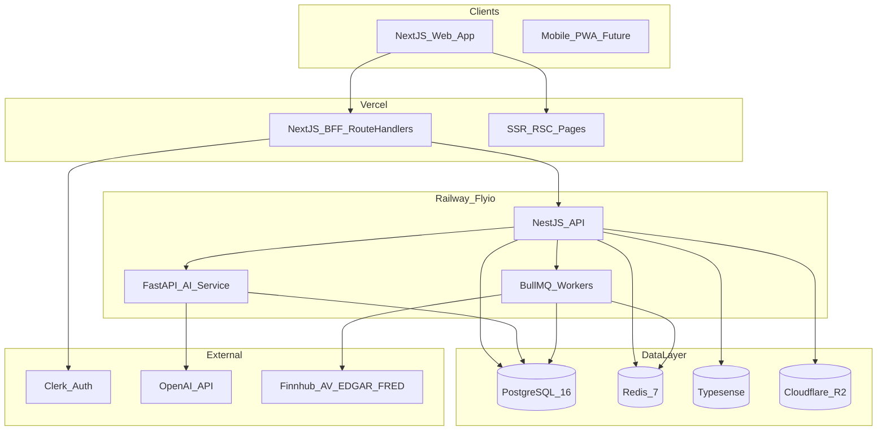

# VirtuaQuest — Architecture

**Related docs:** [09-DATABASE.md](./09-DATABASE.md) · [10-API.md](./10-API.md) · [11-SECURITY_COMPLIANCE.md](./11-SECURITY_COMPLIANCE.md)

---

## 1. Architecture Overview



---

## 2. Monorepo Structure

```
virtuaquest/
├── apps/
│   ├── web/                 # Next.js 15 frontend + BFF
│   ├── api/                 # NestJS backend
│   └── ai-service/          # Python FastAPI
├── packages/
│   ├── ui/                  # Shared shadcn components
│   ├── types/               # Shared TypeScript types
│   ├── config/              # ESLint, TSConfig
│   └── market-data/         # MarketDataProvider clients
├── docker/
│   ├── docker-compose.yml
│   ├── Dockerfile.api
│   └── Dockerfile.ai
├── .github/workflows/
│   ├── ci.yml
│   └── deploy.yml
└── docs/                    # This specification
```

**Tooling:** Turborepo, pnpm workspaces, Node 20 LTS, Python 3.12

---

## 3. Technology Stack

| Layer | Technology | Version |
|-------|------------|---------|
| Frontend | Next.js (App Router) | 15.x |
| UI | React, TypeScript, Tailwind, shadcn/ui | React 19 |
| Charts | Lightweight Charts, Recharts | Latest stable |
| BFF | Next.js Route Handlers | — |
| API | NestJS | 10.x |
| AI | FastAPI, LangChain | Python 3.12 |
| ORM | Prisma | 5.x |
| Database | PostgreSQL | 16 |
| Cache/Queue | Redis, BullMQ | 7 |
| Search | Typesense | 0.25+ |
| Auth | Clerk (recommended) or Supabase Auth | — |
| Storage | Cloudflare R2 (S3-compatible) | — |
| Real-time | Socket.io on NestJS | — |
| AI Models | OpenAI GPT-4o-mini, GPT-4o | — |
| Embeddings | text-embedding-3-small | — |
| Observability | OpenTelemetry, Sentry, Grafana Cloud | — |

---

## 4. Service Responsibilities

### 4.1 Next.js Web (`apps/web`)

- SSR/SSG for landing, SEO pages
- React Server Components for dashboard data fetching
- Route Handlers as BFF (proxy to NestJS with session)
- Client components: charts, trading panel, AI chat
- Clerk middleware for auth

### 4.2 NestJS API (`apps/api`)

| Module | Responsibility |
|--------|----------------|
| `AuthModule` | JWT validation, webhook from Clerk |
| `UsersModule` | Profiles, settings, XP |
| `PortfoliosModule` | Portfolios, positions, P&L calculation |
| `OrdersModule` | Order validation, fill engine |
| `MarketModule` | Quotes, charts (via MarketDataProvider) |
| `CompaniesModule` | Company pages, fundamentals cache |
| `LearningModule` | Courses, lessons, quizzes |
| `GamificationModule` | XP, badges, leaderboards |
| `AINModule` | Proxy to FastAPI |
| `NotificationsModule` | In-app notifications |
| `WebSocketModule` | Socket.io gateway |
| `JobsModule` | BullMQ producers |

### 4.3 FastAPI AI Service (`apps/ai-service`)

- Chat completions with RAG
- Summarization endpoints
- Output safety filtering
- Embedding generation jobs
- No direct client access — only NestJS internal network

### 4.4 BullMQ Workers

| Queue | Job | Schedule |
|-------|-----|----------|
| `quotes` | Sync watchlist/index quotes | Every 60s |
| `fundamentals` | Sync company fundamentals | Daily |
| `news` | Ingest news articles | Every 15 min |
| `filings` | Parse EDGAR filings | Daily |
| `leaderboard` | Refresh materialized views | Every 5 min |
| `notifications` | Dispatch notifications | On event |
| `embeddings` | Chunk and embed new content | On publish |

---

## 5. Caching Strategy

| Data | Store | TTL | Invalidation |
|------|-------|-----|--------------|
| Quotes | Redis | 60s | Time-based |
| Company overview | Redis | 1h | On fundamentals sync |
| Chart OHLCV daily | Postgres + Redis | 24h | Daily job |
| Leaderboard top 100 | Redis | 5 min | Job refresh |
| User session | Redis | 24h | Logout |
| Search index | Typesense | — | On company/course update |

**Cache-aside pattern:** Read Redis → miss → Postgres/API → write Redis.

---

## 6. Search

**Typesense** collections:
- `symbols` — ticker, name, exchange, sector
- `courses` — title, description
- `glossary` — term, definition
- `news` `[P1]` — headline, body snippet

Sync via BullMQ on data change.

---

## 7. Real-Time (WebSocket)

**Gateway:** NestJS `@WebSocketGateway`

**Authentication:** JWT in handshake query param or cookie

**Rooms:**
- `user:{userId}` — portfolio, notifications
- `competition:{id}` — leaderboard updates `[P1]`
- `symbol:{symbol}` — quote updates `[P1]` (optional)

**Events:** See [10-API.md](./10-API.md#websocket-events)

---

## 8. Deployment

### 8.1 Environments

| Env | Purpose | URL pattern |
|-----|---------|-------------|
| `development` | Local docker-compose | localhost |
| `staging` | Pre-production QA | staging.virtuaquest.com |
| `production` | Live users | virtuaquest.com |

### 8.2 Infrastructure

| Component | Platform |
|-----------|----------|
| Next.js | Vercel |
| NestJS + Workers | Railway or Fly.io |
| FastAPI | Railway or Fly.io |
| PostgreSQL | Railway Postgres or Supabase |
| Redis | Upstash or Railway Redis |
| Typesense | Self-hosted on Fly.io or Typesense Cloud |
| R2 | Cloudflare R2 |

### 8.3 Docker

**docker-compose.yml (local dev):**
- `postgres`, `redis`, `typesense`
- `api`, `ai-service`, `worker`
- Optional: `web` or run Next.js natively

**Production:** Separate Dockerfiles per service; no monolithic container.

---

## 9. CI/CD

### 9.1 GitHub Actions — CI (on PR)

```yaml
# .github/workflows/ci.yml
jobs:
  lint:       # ESLint, Prettier check
  typecheck:  # tsc --noEmit
  test:       # Vitest unit tests
  e2e:        # Playwright (smoke on staging deploy)
```

### 9.2 CD (on merge to main)

1. Run CI
2. Build Docker images → push to registry
3. Deploy staging automatically
4. Manual approval → deploy production
5. Run smoke tests
6. Rollback on failure (previous image tag)

### 9.3 Database Migrations

- Prisma migrate in CI against staging
- Production migration requires approval gate
- Never destructive migrations without backup

---

## 10. Testing Strategy

| Layer | Tool | Coverage target |
|-------|------|-----------------|
| Unit | Vitest | Business logic 80% |
| Integration | Vitest + test Postgres | API modules |
| E2E | Playwright | Critical paths |
| Load | k6 `[P1]` | 100 concurrent users |

**Critical E2E paths (MVP):**
1. Sign up → verify email → dashboard
2. Complete lesson → unlock trading
3. Place paper trade → portfolio updates
4. AI chat → receive response
5. View company page → chart loads

---

## 11. Monitoring & Logging

| Concern | Tool |
|---------|------|
| Errors | Sentry |
| Metrics | OpenTelemetry → Grafana Cloud |
| Logs | Structured JSON (Pino); aggregate in Grafana/Loki |
| Uptime | Better Uptime or UptimeRobot |
| Data provider health | Custom metric: quote staleness % |

**Alerts:**
- API error rate > 1% for 5 min
- Quote staleness > 30 min for >5% symbols
- AI service latency P95 > 5s
- Database connection pool exhaustion

---

## 12. Scalability Notes

| Bottleneck | Mitigation |
|------------|------------|
| Market data rate limits | Aggressive Redis cache; batch symbol requests |
| AI costs | GPT-4o-mini default; rate limits per tier |
| Leaderboard queries | Materialized views + Redis snapshot |
| WebSocket connections | Horizontal NestJS replicas + Redis adapter |
| Postgres write load | Read replicas for analytics `[P1]` |

**Horizontal scaling:** Stateless API and AI services behind load balancer.

---

## 13. Environment Variables

| Variable | Service | Description |
|----------|---------|-------------|
| `DATABASE_URL` | All | Postgres connection |
| `REDIS_URL` | API, Workers | Redis connection |
| `CLERK_SECRET_KEY` | Web, API | Auth |
| `OPENAI_API_KEY` | AI | LLM |
| `FINNHUB_API_KEY` | Workers | Market data |
| `ALPHA_VANTAGE_API_KEY` | Workers | Fallback quotes |
| `FMP_API_KEY` | Workers | Fundamentals |
| `FRED_API_KEY` | Workers | Economic data |
| `R2_*` | API | Object storage |
| `TYPESENSE_*` | API, Workers | Search |
| `SENTRY_DSN` | All | Error tracking |

Never commit secrets; use platform secret managers.

---

## 14. Trade-Off Decisions

| Decision | Chosen | Rejected | Rationale |
|----------|--------|----------|-----------|
| Monorepo | Turborepo | Polyrepo | Shared types, faster MVP |
| API style | REST + OpenAPI | GraphQL | Simpler caching, easier onboarding |
| ORM | Prisma | Drizzle, raw SQL | Migration tooling, type safety |
| Auth | Clerk | Custom JWT | OAuth, MFA, email verification |
| AI isolation | Separate FastAPI | All in NestJS | Python ML ecosystem |
| Search | Typesense | Elasticsearch | Lower ops cost at MVP |
