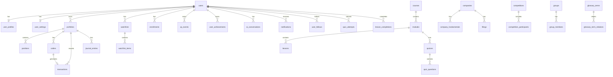

# VirtuaQuest — Database Schema

**Related docs:** [08-ARCHITECTURE.md](./08-ARCHITECTURE.md) · [10-API.md](./10-API.md)

**ORM:** Prisma  
**Database:** PostgreSQL 16  
**Extensions:** `pgvector` (AI embeddings), `uuid-ossp`

---

## 1. Entity Relationship Diagram

---

## 2. Core Tables

### 2.1 users

| Column | Type | Notes |
|--------|------|-------|
| id | UUID PK | |
| clerk_id | VARCHAR UNIQUE | External auth ID |
| email | VARCHAR UNIQUE | |
| email_verified | BOOLEAN | Default false |
| role | ENUM | student, teacher, parent, admin, moderator |
| created_at | TIMESTAMPTZ | |
| updated_at | TIMESTAMPTZ | |
| deleted_at | TIMESTAMPTZ | Soft delete |

**Indexes:** `clerk_id`, `email`

---

### 2.2 user_profiles

| Column | Type | Notes |
|--------|------|-------|
| id | UUID PK | |
| user_id | UUID FK UNIQUE | |
| username | VARCHAR UNIQUE | URL slug |
| display_name | VARCHAR | |
| avatar_url | VARCHAR | R2 URL |
| bio | TEXT | Max 500 |
| country | CHAR(2) | ISO code |
| school | VARCHAR | `[P1]` |
| university | VARCHAR | `[P1]` |
| experience_mode | ENUM | beginner, student, professional |
| financial_goals | JSONB | Array of strings |
| investment_style | VARCHAR | `[P1]` |
| risk_profile | ENUM | conservative, moderate, aggressive `[P1]` |
| skills | JSONB | `[P1]` |
| interests | JSONB | `[P1]` |
| total_xp | INT | Default 0 |
| learning_xp | INT | Default 0 |
| trading_xp | INT | Default 0 |
| level | INT | Default 1 |
| coins | INT | Default 0 `[P1]` |
| portfolio_visibility | ENUM | private, public_return, public_full |
| is_public | BOOLEAN | Profile visibility |
| streak_days | INT | Default 0 `[P1]` |
| last_active_date | DATE | |

**Indexes:** `username`, `user_id`

---

### 2.3 user_settings

| Column | Type | Notes |
|--------|------|-------|
| user_id | UUID FK PK | |
| theme | ENUM | light, dark, system |
| email_notifications | BOOLEAN | |
| push_notifications | BOOLEAN | |
| leaderboard_opt_out | BOOLEAN | `[P1]` |
| terminal_layout | JSONB | `[P1]` |

---

### 2.4 parent_child_links `[P1]`

| Column | Type | Notes |
|--------|------|-------|
| parent_user_id | UUID FK | |
| child_user_id | UUID FK | |
| verified | BOOLEAN | |
| created_at | TIMESTAMPTZ | |

---

## 3. Trading & Portfolio Tables

### 3.1 portfolios

| Column | Type | Notes |
|--------|------|-------|
| id | UUID PK | |
| user_id | UUID FK | |
| name | VARCHAR | Default "My Portfolio" |
| type | ENUM | personal, competition, classroom |
| competition_id | UUID FK NULL | |
| starting_capital | DECIMAL(18,2) | |
| cash_balance | DECIMAL(18,2) | |
| is_public | BOOLEAN | Default false |
| created_at | TIMESTAMPTZ | |

**Indexes:** `user_id`, `competition_id`

---

### 3.2 positions

| Column | Type | Notes |
|--------|------|-------|
| id | UUID PK | |
| portfolio_id | UUID FK | |
| symbol | VARCHAR | |
| quantity | DECIMAL(18,4) | |
| avg_cost | DECIMAL(18,4) | Weighted average |
| updated_at | TIMESTAMPTZ | |

**Unique:** `(portfolio_id, symbol)`  
**Indexes:** `portfolio_id`

---

### 3.3 orders

| Column | Type | Notes |
|--------|------|-------|
| id | UUID PK | |
| portfolio_id | UUID FK | |
| symbol | VARCHAR | |
| side | ENUM | buy, sell |
| type | ENUM | market, limit, stop, stop_limit |
| quantity | DECIMAL(18,4) | |
| limit_price | DECIMAL(18,4) NULL | |
| stop_price | DECIMAL(18,4) NULL | |
| status | ENUM | pending, open, filled, cancelled, rejected |
| filled_price | DECIMAL(18,4) NULL | |
| filled_at | TIMESTAMPTZ NULL | |
| reject_reason | VARCHAR NULL | |
| created_at | TIMESTAMPTZ | |

**Indexes:** `portfolio_id`, `status`, `created_at DESC`

---

### 3.4 transactions

| Column | Type | Notes |
|--------|------|-------|
| id | UUID PK | |
| portfolio_id | UUID FK | |
| order_id | UUID FK | |
| symbol | VARCHAR | |
| side | ENUM | buy, sell |
| quantity | DECIMAL(18,4) | |
| price | DECIMAL(18,4) | |
| total | DECIMAL(18,2) | |
| realized_pnl | DECIMAL(18,2) NULL | On sell |
| executed_at | TIMESTAMPTZ | |

**Indexes:** `portfolio_id`, `executed_at DESC`, `symbol`

---

### 3.5 journal_entries

| Column | Type | Notes |
|--------|------|-------|
| id | UUID PK | |
| user_id | UUID FK | |
| transaction_id | UUID FK NULL | |
| title | VARCHAR NULL | `[P1]` public journals |
| rationale | TEXT | |
| thesis_tags | JSONB | `[P1]` |
| is_public | BOOLEAN | Default false |
| created_at | TIMESTAMPTZ | |

---

### 3.6 portfolio_snapshots `[P1]`

Daily snapshot for performance charts.

| Column | Type | Notes |
|--------|------|-------|
| portfolio_id | UUID FK | |
| date | DATE | |
| total_value | DECIMAL(18,2) | |
| cash | DECIMAL(18,2) | |

**Unique:** `(portfolio_id, date)`

---

## 4. Market Data Tables

### 4.1 companies

| Column | Type | Notes |
|--------|------|-------|
| symbol | VARCHAR PK | |
| name | VARCHAR | |
| exchange | VARCHAR | |
| sector | VARCHAR | |
| industry | VARCHAR | |
| description | TEXT | |
| website | VARCHAR | |
| ceo | VARCHAR | `[P1]` |
| employees | INT | `[P1]` |
| headquarters | VARCHAR | `[P1]` |
| logo_url | VARCHAR | |
| updated_at | TIMESTAMPTZ | |

**Indexes:** `name` (trigram for search)

---

### 4.2 company_fundamentals

| Column | Type | Notes |
|--------|------|-------|
| id | UUID PK | |
| symbol | VARCHAR FK | |
| period | ENUM | annual, quarterly |
| fiscal_date | DATE | |
| data | JSONB | Full statement metrics |
| updated_at | TIMESTAMPTZ | |

**Indexes:** `symbol`, `fiscal_date DESC`

---

### 4.3 ohlcv_cache

| Column | Type | Notes |
|--------|------|-------|
| symbol | VARCHAR | |
| interval | VARCHAR | 1d, 1h, etc. |
| date | DATE | |
| open, high, low, close | DECIMAL | |
| volume | BIGINT | |

**Unique:** `(symbol, interval, date)`

---

### 4.4 filings `[P1]`

| Column | Type | Notes |
|--------|------|-------|
| id | UUID PK | |
| symbol | VARCHAR FK | |
| type | VARCHAR | 10-K, 10-Q, 8-K |
| filed_at | DATE | |
| url | VARCHAR | EDGAR link |
| summary | TEXT NULL | AI summary |

---

### 4.5 news_articles `[P1]`

| Column | Type | Notes |
|--------|------|-------|
| id | UUID PK | |
| headline | VARCHAR | |
| source | VARCHAR | |
| url | VARCHAR UNIQUE | |
| symbols | JSONB | Related tickers |
| published_at | TIMESTAMPTZ | |
| summary | TEXT NULL | |

---

## 5. Learning Tables

### 5.1 courses

| Column | Type | Notes |
|--------|------|-------|
| id | UUID PK | |
| slug | VARCHAR UNIQUE | |
| title | VARCHAR | |
| description | TEXT | |
| difficulty | ENUM | beginner, intermediate, advanced |
| xp_reward | INT | |
| published | BOOLEAN | |
| sort_order | INT | |

---

### 5.2 modules

| Column | Type | Notes |
|--------|------|-------|
| id | UUID PK | |
| course_id | UUID FK | |
| title | VARCHAR | |
| sort_order | INT | |

---

### 5.3 lessons

| Column | Type | Notes |
|--------|------|-------|
| id | UUID PK | |
| module_id | UUID FK | |
| slug | VARCHAR | |
| title | VARCHAR | |
| content | TEXT | Markdown |
| estimated_minutes | INT | |
| xp_reward | INT | |
| unlocks_feature | VARCHAR NULL | e.g. paper_trading |
| sort_order | INT | |

---

### 5.4 quizzes / quiz_questions / quiz_attempts

Standard normalized quiz schema with JSONB for options, `score`, `passed` on attempts.

---

### 5.5 enrollments

| Column | Type | Notes |
|--------|------|-------|
| user_id | UUID FK | |
| course_id | UUID FK | |
| progress_pct | INT | |
| completed_at | TIMESTAMPTZ NULL | |

**Unique:** `(user_id, course_id)`

---

### 5.6 glossary_terms

| Column | Type | Notes |
|--------|------|-------|
| id | UUID PK | |
| slug | VARCHAR UNIQUE | |
| term | VARCHAR | |
| definition | TEXT | |
| formula | VARCHAR NULL | |
| importance | TEXT | |
| beginner_explanation | TEXT | |
| advanced_explanation | TEXT | |
| example | TEXT | |
| embedding | VECTOR(1536) | pgvector `[P1]` |

---

## 6. Gamification Tables

### 6.1 achievements

| Column | Type | Notes |
|--------|------|-------|
| id | UUID PK | |
| slug | VARCHAR UNIQUE | |
| name | VARCHAR | |
| description | TEXT | |
| icon | VARCHAR | |
| rarity | ENUM | common, rare, epic, legendary |
| criteria | JSONB | Trigger rules |

---

### 6.2 user_achievements

| Column | Type | Notes |
|--------|------|-------|
| user_id | UUID FK | |
| achievement_id | UUID FK | |
| earned_at | TIMESTAMPTZ | |

**Unique:** `(user_id, achievement_id)`

---

### 6.3 xp_events

| Column | Type | Notes |
|--------|------|-------|
| id | UUID PK | |
| user_id | UUID FK | |
| amount | INT | |
| type | ENUM | learning, trading, bonus |
| source | VARCHAR | lesson_complete, trade, etc. |
| source_id | UUID NULL | |
| created_at | TIMESTAMPTZ | |

**Indexes:** `user_id`, `created_at DESC`

---

### 6.4 leaderboard_snapshots

| Column | Type | Notes |
|--------|------|-------|
| id | UUID PK | |
| type | ENUM | investors, learners |
| scope | VARCHAR | global, school, etc. |
| period | VARCHAR | all_time, weekly, monthly |
| rankings | JSONB | Array of {userId, username, score, rank} |
| refreshed_at | TIMESTAMPTZ | |

---

## 7. Social & Community Tables

### 7.1 user_follows

| follower_id | UUID FK | |
| following_id | UUID FK | |
| created_at | TIMESTAMPTZ | |

**Unique:** `(follower_id, following_id)`

---

### 7.2 groups / group_members

Standard group membership with `role`: member, admin.

---

### 7.3 comments / likes / reports

Polymorphic `target_type` + `target_id` for comments and likes.

---

### 7.4 activity_events `[P1]`

| Column | Type | Notes |
|--------|------|-------|
| user_id | UUID FK | |
| type | VARCHAR | badge_earned, course_complete, etc. |
| payload | JSONB | |
| created_at | TIMESTAMPTZ | |

---

## 8. Competition Tables

### 8.1 competitions

| Column | Type | Notes |
|--------|------|-------|
| id | UUID PK | |
| name | VARCHAR | |
| type | ENUM | tournament, season, weekly |
| starts_at | TIMESTAMPTZ | |
| ends_at | TIMESTAMPTZ | |
| rules | JSONB | |
| status | ENUM | upcoming, active, ended |

---

### 8.2 competition_participants

| competition_id | UUID FK | |
| user_id | UUID FK | |
| portfolio_id | UUID FK | |
| return_pct | DECIMAL | Updated on refresh |
| rank | INT NULL | |

---

## 9. AI Tables

### 9.1 ai_conversations

| Column | Type | Notes |
|--------|------|-------|
| id | UUID PK | |
| user_id | UUID FK | |
| mode | VARCHAR | tutor, coach, etc. |
| title | VARCHAR | Auto-generated |
| created_at | TIMESTAMPTZ | |

---

### 9.2 ai_messages

| Column | Type | Notes |
|--------|------|-------|
| id | UUID PK | |
| conversation_id | UUID FK | |
| role | ENUM | user, assistant |
| content | TEXT | |
| citations | JSONB NULL | |
| created_at | TIMESTAMPTZ | |

---

### 9.3 document_embeddings `[P1]`

| Column | Type | Notes |
|--------|------|-------|
| id | UUID PK | |
| source_type | VARCHAR | filing, lesson, glossary |
| source_id | VARCHAR | |
| chunk_index | INT | |
| content | TEXT | |
| embedding | VECTOR(1536) | |

**Index:** IVFFlat or HNSW on embedding

---

## 10. Notifications & Alerts

### 10.1 notifications

| Column | Type | Notes |
|--------|------|-------|
| id | UUID PK | |
| user_id | UUID FK | |
| type | VARCHAR | |
| title | VARCHAR | |
| body | TEXT | |
| read | BOOLEAN | |
| data | JSONB | Deep link payload |
| created_at | TIMESTAMPTZ | |

---

### 10.2 alerts `[P1]`

| Column | Type | Notes |
|--------|------|-------|
| user_id | UUID FK | |
| symbol | VARCHAR | |
| type | ENUM | price_above, price_below, earnings |
| threshold | DECIMAL NULL | |
| triggered | BOOLEAN | |

---

## 11. Personal Finance Tables `[P2]`

- `budgets`, `budget_categories`, `expenses`
- `financial_goals`
- `net_worth_snapshots`, `assets`, `liabilities`

---

## 12. Admin & Audit

### 12.1 audit_logs

| Column | Type | Notes |
|--------|------|-------|
| id | UUID PK | |
| actor_id | UUID FK | |
| action | VARCHAR | |
| target_type | VARCHAR | |
| target_id | UUID | |
| metadata | JSONB | |
| created_at | TIMESTAMPTZ | |

---

## 13. Index Strategy Summary

| Table | Index | Purpose |
|-------|-------|---------|
| transactions | (portfolio_id, executed_at DESC) | History pagination |
| orders | (portfolio_id, status) | Open orders |
| xp_events | (user_id, created_at DESC) | XP history |
| companies | GIN trigram on name | Fuzzy search |
| notifications | (user_id, read, created_at DESC) | Unread feed |
| ohlcv_cache | (symbol, interval, date DESC) | Chart data |

---

## 14. Migration Strategy

1. **Prisma migrate dev** for local development
2. **Squash migrations** before major releases
3. **Backward-compatible migrations** — add column nullable first, backfill, then constrain
4. **Seed script** for: achievements, MVP courses, glossary (100 terms), top 500 companies
5. **No direct production SQL** — all via Prisma migrate

---

## 15. Table Count Summary

| Domain | Tables | MVP |
|--------|--------|-----|
| Users & auth | 5 | 3 |
| Trading | 6 | 5 |
| Market data | 5 | 2 |
| Learning | 8 | 7 |
| Gamification | 4 | 4 |
| Social | 6 | 0 |
| Competitions | 3 | 0 |
| AI | 3 | 2 |
| Notifications | 2 | 1 |
| Admin | 1 | 0 |
| Personal finance | 6 | 0 |
| **Total** | **~49** | **~24** |
