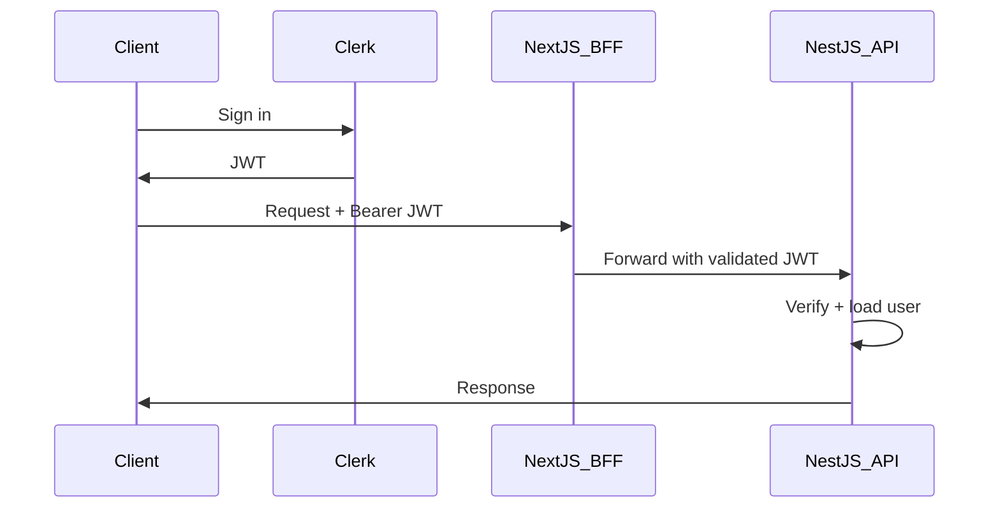

# VirtuaQuest — REST API Specification

**Base URL:** `https://api.virtuaquest.com/v1`  
**Related docs:** [08-ARCHITECTURE.md](./08-ARCHITECTURE.md) · [09-DATABASE.md](./09-DATABASE.md) · [11-SECURITY_COMPLIANCE.md](./11-SECURITY_COMPLIANCE.md)

---

## 1. Conventions

| Aspect | Standard |
|--------|----------|
| Format | JSON (`Content-Type: application/json`) |
| Auth | Bearer JWT (Clerk-issued) in `Authorization` header |
| Pagination | Cursor-based: `?cursor=&limit=20` (default limit 20, max 100) |
| Errors | `{ "error": { "code": "...", "message": "..." } }` |
| Dates | ISO 8601 UTC |
| Money | Decimal strings `"1234.56"` (avoid float precision issues) |
| Version | URL prefix `/v1` |

---

## 2. Authentication

### Public Endpoints (no auth)
- `POST /auth/register`
- `POST /auth/login`
- `POST /auth/forgot-password`
- `POST /auth/verify-email`
- `GET /health`
- `GET /companies/:symbol` (limited fields for SEO)

### Auth Flow



**Webhook:** `POST /auth/webhook` — Clerk user sync (create/update `users` row)

---

## 3. Rate Limits

| Tier | General API | AI endpoints |
|------|-------------|--------------|
| Anonymous | 10/min | N/A |
| Authenticated (free) | 100/min | 20/hour |
| Student Plus | 300/min | 100/hour |
| Teacher Pro | 500/min | 200/hour |

**Headers:**
- `X-RateLimit-Limit`
- `X-RateLimit-Remaining`
- `X-RateLimit-Reset`

**429 Response:** `{ "error": { "code": "RATE_LIMITED", "message": "..." } }`

---

## 4. Error Codes

| HTTP | Code | Description |
|------|------|-------------|
| 400 | `VALIDATION_ERROR` | Invalid input |
| 401 | `UNAUTHORIZED` | Missing/invalid token |
| 403 | `FORBIDDEN` | Insufficient permissions |
| 404 | `NOT_FOUND` | Resource not found |
| 409 | `CONFLICT` | Duplicate resource |
| 422 | `BUSINESS_RULE_VIOLATION` | e.g. insufficient funds |
| 429 | `RATE_LIMITED` | Too many requests |
| 500 | `INTERNAL_ERROR` | Server error |

---

## 5. MVP Endpoints (~40)

### 5.1 Auth & Users

| Method | Path | Priority | Description |
|--------|------|----------|-------------|
| POST | `/auth/webhook` | MVP | Clerk webhook |
| GET | `/users/me` | MVP | Current user + profile |
| PATCH | `/users/me` | MVP | Update profile |
| GET | `/users/me/settings` | MVP | Get settings |
| PATCH | `/users/me/settings` | MVP | Update settings |
| GET | `/users/:username/public` | MVP | Public profile |
| GET | `/users/me/xp` | MVP | XP breakdown |

---

### 5.2 Portfolios & Trading

| Method | Path | Priority | Description |
|--------|------|----------|-------------|
| GET | `/portfolios` | MVP | List user portfolios |
| POST | `/portfolios` | MVP | Create portfolio |
| GET | `/portfolios/:id` | MVP | Portfolio summary |
| GET | `/portfolios/:id/positions` | MVP | Holdings |
| POST | `/portfolios/:id/orders` | MVP | Submit order |
| GET | `/portfolios/:id/orders` | MVP | Order history |
| GET | `/portfolios/:id/transactions` | MVP | Transaction history |
| POST | `/portfolios/:id/journal` | MVP | Add journal entry |
| GET | `/portfolios/:id/performance` | P1 | Performance metrics |
| DELETE | `/portfolios/:id/orders/:orderId` | P1 | Cancel open order |

**POST `/portfolios/:id/orders` body:**
```json
{
  "symbol": "AAPL",
  "side": "buy",
  "type": "market",
  "quantity": "10.5",
  "journal": "Learning about tech diversification"
}
```

**Response (filled):**
```json
{
  "order": {
    "id": "uuid",
    "status": "filled",
    "filled_price": "175.50",
    "filled_at": "2026-06-29T12:00:00Z"
  },
  "portfolio": {
    "cash_balance": "98245.00",
    "total_value": "100000.00"
  }
}
```

---

### 5.3 Market Data

| Method | Path | Priority | Description |
|--------|------|----------|-------------|
| GET | `/quotes/:symbol` | MVP | Current quote |
| GET | `/quotes/batch?symbols=AAPL,MSFT` | MVP | Batch quotes |
| GET | `/charts/:symbol?interval=1d&range=1y` | MVP | OHLCV data |
| GET | `/indices` | MVP | Major indices |
| GET | `/search?q=` | MVP | Symbol search |

**GET `/quotes/:symbol` response:**
```json
{
  "symbol": "AAPL",
  "price": "175.50",
  "change": "2.30",
  "change_pct": "1.33",
  "volume": 45000000,
  "delayed": true,
  "delayed_minutes": 15,
  "updated_at": "2026-06-29T11:45:00Z"
}
```

---

### 5.4 Companies

| Method | Path | Priority | Description |
|--------|------|----------|-------------|
| GET | `/companies/:symbol` | MVP | Overview |
| GET | `/companies/:symbol/financials` | MVP | Statements |
| GET | `/companies/:symbol/metrics` | MVP | Key ratios |
| GET | `/companies/:symbol/business` | P1 | Business tab |
| GET | `/companies/:symbol/news` | P1 | News feed |
| GET | `/companies/:symbol/filings` | P1 | SEC filings |
| GET | `/companies/:symbol/analysis` | P1 | AI analysis |

---

### 5.5 Watchlists

| Method | Path | Priority | Description |
|--------|------|----------|-------------|
| GET | `/watchlists` | MVP | List watchlists |
| POST | `/watchlists` | MVP | Create watchlist |
| POST | `/watchlists/:id/items` | MVP | Add symbol |
| DELETE | `/watchlists/:id/items/:symbol` | MVP | Remove symbol |
| PATCH | `/watchlists/:id/items/reorder` | P1 | Reorder |

---

### 5.6 Learning

| Method | Path | Priority | Description |
|--------|------|----------|-------------|
| GET | `/courses` | MVP | Course catalog |
| GET | `/courses/:slug` | MVP | Course detail |
| GET | `/lessons/:id` | MVP | Lesson content |
| POST | `/lessons/:id/complete` | MVP | Mark complete + XP |
| GET | `/quizzes/:id` | MVP | Quiz questions |
| POST | `/quizzes/:id/submit` | MVP | Submit answers |
| GET | `/glossary/:slug` | MVP | Term definition |
| GET | `/glossary?q=` | MVP | Search dictionary |

---

### 5.7 AI

| Method | Path | Priority | Description |
|--------|------|----------|-------------|
| POST | `/ai/chat` | MVP | Send message |
| GET | `/ai/conversations` | MVP | List threads |
| GET | `/ai/conversations/:id/messages` | MVP | Thread messages |
| POST | `/ai/explain` | MVP | Explain term/concept |
| POST | `/ai/summarize/news` | P1 | Summarize article |
| POST | `/ai/summarize/filing` | P1 | Summarize SEC filing |
| POST | `/ai/summarize/earnings` | P1 | Earnings summary |
| POST | `/ai/portfolio-review` | P1 | Portfolio analysis |
| POST | `/ai/risk-analysis` | P1 | Risk education |
| POST | `/ai/compare` | P1 | Compare companies |
| POST | `/ai/debate` | P1 | Debate mode |
| POST | `/ai/generate/quiz` | P1 | Generate quiz |
| POST | `/ai/generate/flashcards` | P1 | Generate flashcards |
| POST | `/ai/daily-lesson` | P1 | Daily lesson |

---

### 5.8 Gamification & Leaderboards

| Method | Path | Priority | Description |
|--------|------|----------|-------------|
| GET | `/achievements` | MVP | All achievements |
| GET | `/users/me/achievements` | MVP | User badges |
| GET | `/leaderboards` | MVP | Rankings |
| GET | `/leaderboards/me` | MVP | User rank |

**GET `/leaderboards?type=investors&scope=global&period=all_time`**

---

### 5.9 Notifications

| Method | Path | Priority | Description |
|--------|------|----------|-------------|
| GET | `/notifications` | MVP | List notifications |
| PATCH | `/notifications/:id/read` | MVP | Mark read |
| POST | `/notifications/read-all` | MVP | Mark all read |

---

### 5.10 Dashboard

| Method | Path | Priority | Description |
|--------|------|----------|-------------|
| GET | `/dashboard` | MVP | Aggregated dashboard data |

BFF endpoint combining portfolio, watchlist, learning progress, indices, recent trades.

---

## 6. P1 Endpoints (Additional ~50)

### Social
- `POST /users/:id/follow`
- `DELETE /users/:id/follow`
- `GET /users/:id/followers`
- `GET /feed`

### Groups
- `GET/POST /groups`
- `POST /groups/:id/join`

### Competitions
- `GET /competitions`
- `POST /competitions/:id/join`
- `GET /competitions/:id/leaderboard`

### Screeners
- `POST /screeners/run`
- `GET/POST /screeners/saved`

### Calendars & News
- `GET /calendars/:type`
- `GET /news`

### Alerts
- `GET/POST /alerts`
- `DELETE /alerts/:id`

### Admin (see [12-ADMIN.md](./12-ADMIN.md))
- `GET /admin/users`
- `PATCH /admin/users/:id`
- `GET/POST /admin/courses`
- etc.

---

## 7. P2 Endpoints

### Personal Finance
- `GET/POST /budgets`
- `GET/POST /expenses`
- `GET/POST /financial-goals`
- `GET/POST /net-worth`

---

## 8. WebSocket Events

**URL:** `wss://api.virtuaquest.com/ws`  
**Auth:** JWT in query `?token=` or cookie

### Client → Server

| Event | Payload | Description |
|-------|---------|-------------|
| `subscribe:portfolio` | `{ portfolioId }` | Portfolio updates |
| `subscribe:competition` | `{ competitionId }` | Leaderboard updates `[P1]` |
| `unsubscribe` | `{ room }` | Leave room |

### Server → Client

| Event | Payload | Description |
|-------|---------|-------------|
| `portfolio:update` | `{ portfolioId, cash, totalValue, positions[] }` | After fill |
| `order:filled` | `{ orderId, symbol, side, quantity, price }` | Order filled |
| `notification:new` | `{ id, type, title, body }` | New notification |
| `leaderboard:update` | `{ competitionId, rankings[] }` | `[P1]` |
| `quote:update` | `{ symbol, price, change_pct }` | `[P1]` optional |

---

## 9. Permissions (RBAC)

| Role | Capabilities |
|------|--------------|
| `student` | Default; all user features |
| `teacher` | + classroom management `[P2]` |
| `parent` | + view linked child progress `[P1]` |
| `moderator` | + moderation queue |
| `admin` | Full admin panel |

Enforced via NestJS guards: `@Roles('admin')`

Full matrix: [11-SECURITY_COMPLIANCE.md](./11-SECURITY_COMPLIANCE.md)

---

## 10. OpenAPI

Generate OpenAPI 3.1 spec from NestJS decorators (`@nestjs/swagger`).

**Publish at:** `https://api.virtuaquest.com/v1/openapi.json`  
**Swagger UI:** Staging only (not production public)

---

## 11. Idempotency

**POST `/portfolios/:id/orders`** accepts optional header:
`Idempotency-Key: <uuid>`

Duplicate requests within 24h return same response without double execution.

---

## 12. Webhooks (Outbound) `[P1]`

For school integrations:
- `competition.ended`
- `user.course_completed`

HMAC-signed payloads to registered URLs.
