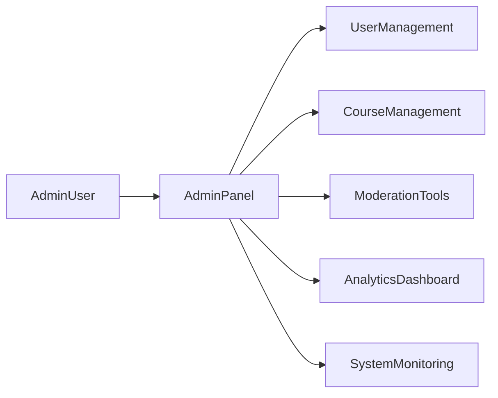

# VirtuaQuest — Admin Panel

**Related docs:** [10-API.md](./10-API.md) · [11-SECURITY_COMPLIANCE.md](./11-SECURITY_COMPLIANCE.md) · [05-AI_SYSTEM.md](./05-AI_SYSTEM.md)

**Priority:** `[P1]`  
**Route prefix:** `/admin`  
**Access:** `admin` and `moderator` roles only

---

## 1. Overview

The admin panel provides internal tools for user management, content curation, moderation, analytics, and system monitoring. It is a separate layout from the main app with sidebar navigation.



---

## 2. Navigation Structure

| Section | Role | Route |
|---------|------|-------|
| Dashboard | admin | `/admin` |
| Users | admin | `/admin/users` |
| Companies | admin | `/admin/companies` |
| News | admin | `/admin/news` |
| Courses | admin | `/admin/courses` |
| Achievements | admin | `/admin/achievements` |
| Challenges | admin | `/admin/challenges` |
| Leaderboards | admin | `/admin/leaderboards` |
| AI Content Review | admin, moderator | `/admin/ai-review` |
| Moderation | admin, moderator | `/admin/moderation` |
| Analytics | admin | `/admin/analytics` |
| System | admin | `/admin/system` |

---

## 3. User Management `[P1]`

### Features

| Feature | Description |
|---------|-------------|
| User list | Search, filter by role, status, date joined |
| User detail | Profile, XP, portfolios, flags, activity summary |
| Edit role | Assign student, teacher, parent, moderator, admin |
| Suspend | Temporary ban; user cannot login |
| Ban | Permanent ban with reason |
| Reset progress | Clear XP/courses (with confirmation) `[P2]` |
| Impersonate | View as user (read-only) for support `[P2]` |
| Parent-child links | Manage verified links |

### User Story

*As an admin, I want to search and manage user accounts, so that I can handle abuse and support requests.*

### Acceptance Criteria

- [ ] Search by email, username, user ID
- [ ] Filter: role, suspended, email verified
- [ ] Suspend requires reason (stored in audit log)
- [ ] Ban requires confirmation modal + reason
- [ ] All actions logged to `audit_logs`

### API

| Method | Path |
|--------|------|
| GET | `/admin/users?search=&role=&page=` |
| GET | `/admin/users/:id` |
| PATCH | `/admin/users/:id` |
| POST | `/admin/users/:id/suspend` |
| POST | `/admin/users/:id/ban` |

---

## 4. Company Management `[P1]`

### Features

| Feature | Description |
|---------|-------------|
| Symbol list | Browse/search all companies in DB |
| Edit metadata | Override description, sector, CEO, etc. |
| Trigger sync | Force fundamentals refresh from providers |
| Hide symbol | Remove from search (delisted, bad data) |
| Timeline editor | Add/edit company history milestones |

### Acceptance Criteria

- [ ] Manual override flagged as `source: admin` vs `source: api`
- [ ] Sync job queued on "Refresh fundamentals" click
- [ ] Audit log on edits

### API

| Method | Path |
|--------|------|
| GET | `/admin/companies?search=` |
| PATCH | `/admin/companies/:symbol` |
| POST | `/admin/companies/:symbol/sync` |

---

## 5. News Management `[P1]`

### Features

| Feature | Description |
|---------|-------------|
| News feed | All ingested articles |
| Feature article | Pin to dashboard/news page |
| Hide article | Remove from feeds (spam, irrelevant) |
| Manual add | Add article URL for ingestion |
| Regenerate summary | Re-run AI summary |

### API

| Method | Path |
|--------|------|
| GET | `/admin/news` |
| PATCH | `/admin/news/:id` |
| POST | `/admin/news/ingest` |
| POST | `/admin/news/:id/resummarize` |

---

## 6. Course Management `[P1]`

### Features

| Feature | Description |
|---------|-------------|
| Course CRUD | Create, edit, publish, unpublish courses |
| Module/Lesson editor | Markdown editor with preview |
| Quiz builder | Add/edit questions, set pass threshold |
| Publish workflow | Draft → Review → Published |
| Reorder | Drag modules and lessons |
| Unlock rules | Configure feature unlocks per lesson |
| Seed import | Import course from JSON |

### User Story

*As an admin, I want to create and publish courses, so that learners have up-to-date educational content.*

### Acceptance Criteria

- [ ] WYSIWYG or markdown editor for lesson content
- [ ] Preview lesson before publish
- [ ] Unpublish hides from catalog but preserves progress
- [ ] Quiz questions support MC, true/false
- [ ] Version history `[P2]`

### API

| Method | Path |
|--------|------|
| GET/POST | `/admin/courses` |
| PATCH | `/admin/courses/:id` |
| POST | `/admin/courses/:id/publish` |
| GET/POST | `/admin/courses/:id/modules` |
| GET/POST | `/admin/lessons` |
| GET/POST | `/admin/quizzes` |

---

## 7. Achievement & Badge Management `[P1]`

### Features

| Feature | Description |
|---------|-------------|
| Achievement list | All badges with criteria |
| Create achievement | Name, description, icon, criteria JSON |
| Edit criteria | Modify trigger rules |
| Manual award | Grant badge to user |
| Revoke badge | Remove incorrectly awarded badge |

### Criteria JSON Example

```json
{
  "trigger": "trade_count",
  "operator": ">=",
  "value": 1
}
```

### API

| Method | Path |
|--------|------|
| GET/POST | `/admin/achievements` |
| PATCH | `/admin/achievements/:id` |
| POST | `/admin/users/:id/achievements` |
| DELETE | `/admin/users/:id/achievements/:achievementId` |

---

## 8. Challenge & Competition Management `[P1]`

### Features

| Feature | Description |
|---------|-------------|
| Create competition | Name, dates, rules, starting capital |
| Edit active competition | Extend end date (with audit) |
| Daily/weekly challenges | Configure question/scenario |
| Season management | Theme, rewards, dates |
| End competition | Freeze rankings, trigger badge awards |

### Acceptance Criteria

- [ ] Cannot reduce end date of active competition without admin confirm
- [ ] Rules JSON validated against schema
- [ ] Leaderboard preview before go-live

### API

| Method | Path |
|--------|------|
| GET/POST | `/admin/competitions` |
| PATCH | `/admin/competitions/:id` |
| POST | `/admin/competitions/:id/end` |
| GET/POST | `/admin/daily-challenges` |
| GET/POST | `/admin/seasons` |

---

## 9. Leaderboard Management `[P1]`

### Features

| Feature | Description |
|---------|-------------|
| View snapshots | Historical leaderboard data |
| Force refresh | Trigger materialized view rebuild |
| Exclude user | Remove cheater from leaderboard |
| Reset season | Clear season scores (with confirm) |

### API

| Method | Path |
|--------|------|
| GET | `/admin/leaderboards?type=&scope=` |
| POST | `/admin/leaderboards/refresh` |
| POST | `/admin/leaderboards/exclude-user` |

---

## 10. AI Content Review `[P1]`

### Features

| Feature | Description |
|---------|-------------|
| Flagged conversations | AI or user-reported |
| Review queue | Approve, edit response, escalate |
| Prompt testing | Test system prompts in sandbox |
| Block patterns | Add phrases to output filter |
| Usage stats | Messages/day, filter trigger rate |

### User Story

*As a moderator, I want to review flagged AI conversations, so that inappropriate content is handled.*

### Acceptance Criteria

- [ ] Queue sorted by severity and date
- [ ] One-click mark resolved
- [ ] Cannot view full conversation without moderator role
- [ ] PII redacted in review UI

### API

| Method | Path |
|--------|------|
| GET | `/admin/ai-review?status=pending` |
| PATCH | `/admin/ai-review/:id` |
| POST | `/admin/ai-review/test-prompt` |

---

## 11. Moderation Tools `[P1]`

### Features

| Feature | Description |
|---------|-------------|
| Report queue | User-reported comments, posts, journals |
| AI flags | Auto-flagged content |
| Actions | Approve, remove, warn user, suspend |
| User history | Past violations for repeat offenders |
| Community guidelines | Edit guidelines text |

### Acceptance Criteria

- [ ] SLA indicator: pending >48h highlighted
- [ ] Remove content soft-deletes with audit trail
- [ ] Warn user sends in-app notification
- [ ] Appeal flow `[P2]`

### API

| Method | Path |
|--------|------|
| GET | `/admin/moderation/reports?status=` |
| PATCH | `/admin/moderation/reports/:id` |
| GET | `/admin/moderation/users/:id/history` |

---

## 12. Analytics Dashboard `[P1]`

### Metrics

| Category | Metrics |
|----------|---------|
| Users | DAU, WAU, MAU, signups, retention D1/D7/D30 |
| Learning | Lessons completed, quiz pass rate, course completion |
| Trading | Paper trades/day, avg trades per user |
| AI | Sessions/day, messages/session, thumbs down rate |
| Gamification | XP earned, badges earned, streak distribution |
| Competitions | Participation rate, completion rate |

### Visualizations

- Line charts: DAU, lessons completed over time
- Funnel: signup → first lesson → first trade
- Table: top courses by completion

### Acceptance Criteria

- [ ] Date range filter
- [ ] Export CSV
- [ ] No PII in aggregate views
- [ ] Refresh every 15 min (cached)

### API

| Method | Path |
|--------|------|
| GET | `/admin/analytics/overview?from=&to=` |
| GET | `/admin/analytics/learning?from=&to=` |
| GET | `/admin/analytics/trading?from=&to=` |
| GET | `/admin/analytics/ai?from=&to=` |

---

## 13. System Monitoring `[P1]`

### Features

| Feature | Description |
|---------|-------------|
| Health status | API, AI service, Postgres, Redis, Typesense |
| Data provider status | Finnhub, AV, FMP last success, error rate |
| Quote staleness | % symbols with stale data |
| Job queue | BullMQ queue depths, failed jobs |
| Error log | Recent Sentry errors (linked) |
| Feature flags | Toggle features without deploy `[P2]` |

### Acceptance Criteria

- [ ] Green/yellow/red status indicators
- [ ] Alert thresholds documented
- [ ] Failed jobs retry button

### API

| Method | Path |
|--------|------|
| GET | `/admin/system/health` |
| GET | `/admin/system/providers` |
| GET | `/admin/system/jobs` |
| POST | `/admin/system/jobs/:id/retry` |

---

## 14. Admin UI Layout

```
┌──────────┬────────────────────────────────────┐
│ Sidebar  │  Page Header + Breadcrumb          │
│          ├────────────────────────────────────┤
│ Nav      │                                    │
│ items    │         Content Area               │
│          │                                    │
│          │                                    │
└──────────┴────────────────────────────────────┘
```

- Dark sidebar, light content area (or full dark)
- Data tables: sortable, filterable, paginated (shadcn DataTable)
- Destructive actions: confirmation modals
- Toast notifications on success/error

---

## 15. Audit Requirements

All admin actions write to `audit_logs`:

| Action | Logged fields |
|--------|---------------|
| User suspend/ban | actor, target user, reason |
| Role change | actor, target, old role, new role |
| Course publish | actor, course id, version |
| Content removal | actor, content type, id, reason |
| Manual badge award | actor, user, achievement |
| Competition create/end | actor, competition id |

Retention: 2 years. Immutable (append-only).

---

## 16. Admin Roles Summary

| Capability | moderator | admin |
|------------|-----------|-------|
| View analytics | No | Yes |
| User management | No | Yes |
| Moderation queue | Yes | Yes |
| AI review | Yes | Yes |
| Course management | No | Yes |
| System monitoring | No | Yes |
| Achievement/competition config | No | Yes |
