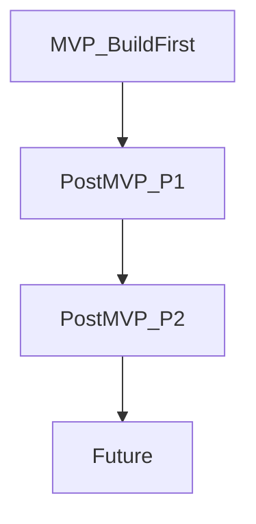
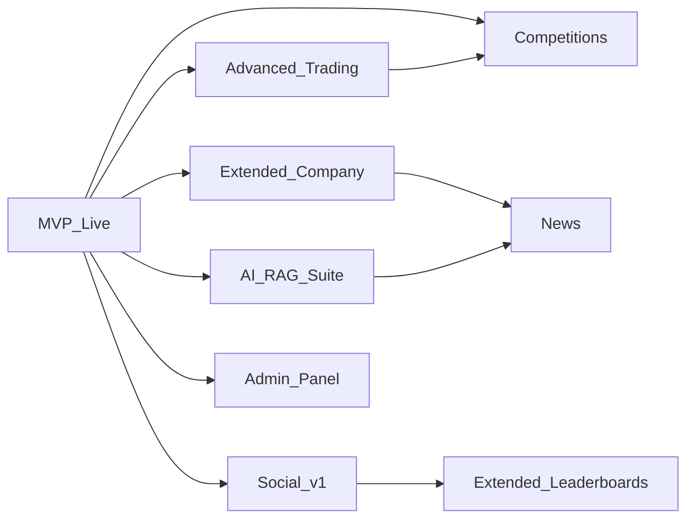
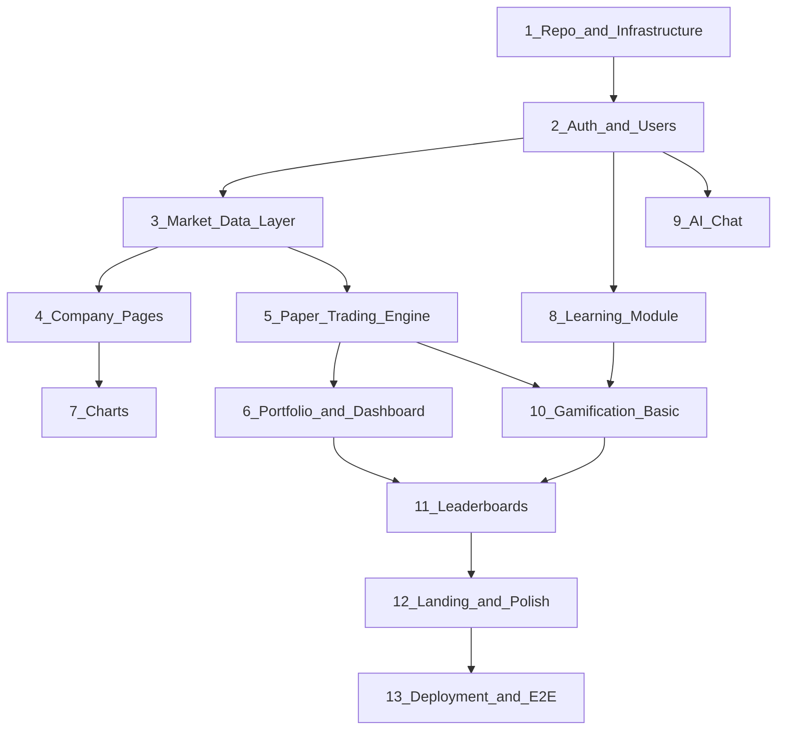

# VirtuaQuest — Build Priorities

**Related docs:** [00-PRODUCT_VISION.md](./00-PRODUCT_VISION.md) · [14-DEVELOPMENT_CHECKLIST.md](./14-DEVELOPMENT_CHECKLIST.md) · [01-FEATURES.md](./01-FEATURES.md)

This document defines **what to build in what order**. There are **no timelines, dates, or duration estimates** — only dependency-ordered priority tiers.

---

## Priority Tier Model

| Tier | Rule |
|------|------|
| **MVP** | Must ship together as one releasable product |
| **P1** | Start only after MVP is live; epics can parallelize within P1 |
| **P2** | Requires P1 features and real usage data |
| **Future** | Requires mature platform + compliance/legal review |

---

## MVP — Build First (10 Pillars)

These pillars define the first releasable version of VirtuaQuest.

| # | Pillar | Deliverables |
|---|--------|--------------|
| 1 | **User Authentication** | Registration, login, logout, forgot password, email verification, OAuth |
| 2 | **Dashboard** | Portfolio value, cash, daily G/L, total return, watchlist, recent trades, market overview, learning progress |
| 3 | **Company Pages** | Overview, business description, key metrics, sector/industry, annual financials |
| 4 | **Paper Trading** | Virtual wallet, buy/sell, market orders, fractional shares, confirmation, history |
| 5 | **Portfolio** | Holdings, allocation, P/L, unrealized/realized gain |
| 6 | **Charts** | Line, candlestick, volume, interactive, time ranges |
| 7 | **AI Chat** | AI Chat Assistant, AI Financial Tutor, Explain Like I'm a Beginner |
| 8 | **Learning Module** | 3 courses, lessons, quizzes, finance dictionary, progress tracking |
| 9 | **Leaderboards** | Global, best investors, best learners |
| 10 | **Deployment** | Staging + production, CI/CD, monitoring, health checks |

### MVP Foundation (Required With MVP)

Ships alongside the 10 pillars — not optional:

- Landing page
- Global navigation + symbol search
- User profile (avatar, bio, experience level, financial goals)
- User settings (theme, notifications, privacy, password)
- Notification center (in-app)
- Dark mode + light mode
- Responsive design (mobile, tablet, desktop)
- Accessibility (WCAG 2.1 AA)
- Educational disclaimers on trading/AI pages
- COPPA age gate

### MVP Technical Deliverables

- Monorepo scaffold (Turborepo)
- PostgreSQL schema (~24 tables)
- NestJS API (~40 endpoints)
- FastAPI AI service (chat only)
- Next.js web app (all MVP screens)
- Redis caching (quotes)
- WebSocket (portfolio updates)
- Clerk auth integration
- Seed data: 3 courses, 100 glossary terms, 500 companies, 10 badges
- CI pipeline (lint, typecheck, test)
- E2E tests: signup, lesson, trade, AI chat

### MVP Explicitly Excluded

- Limit/stop orders
- Social features
- Competitions
- Admin panel
- Screeners, calendars, news
- Personal finance tools
- Research terminal
- RAG on SEC filings
- Email notifications
- Mobile native apps

---

## Post-MVP — P1

Start P1 work only after MVP is deployed and stable. P1 epics can be developed in parallel by separate teams where dependencies allow.

### P1 Epic List

| Epic | Features | Depends On |
|------|----------|------------|
| **Advanced Trading** | Limit orders, stop orders, order cancel, portfolio performance, benchmark comparison | MVP paper trading |
| **Extended Company Data** | Business tab, quarterly financials, filings, news, analysis, ownership | MVP company pages |
| **Market Expansion** | Russell 2000, ETFs, bonds, commodities, forex, crypto display, VIX, Fear & Greed | MVP market data |
| **Charts & TA** | OHLC, comparison charts, SMA, EMA, RSI, MACD, Bollinger, VWAP | MVP charts |
| **Screeners & Calendars** | Stock screener, custom screener, earnings/economic calendars | P1 market data |
| **News** | Global/company news, AI summaries, personalized feed | P1 company data, AI RAG |
| **AI Suite** | 20+ AI features, RAG on filings, portfolio review, debate mode, generators | MVP AI chat |
| **Full Gamification** | Daily streak, weekly missions, seasons, 40+ badges, coins/shop | MVP XP/badges |
| **Extended Leaderboards** | Friends, weekly/monthly, country, school, university | MVP leaderboards, P1 social |
| **Social v1** | Follow, public portfolios, activity feed, comments, likes, groups | MVP profiles |
| **Competitions** | Daily/weekly challenges, tournaments, monthly seasons | MVP paper trading |
| **Profile & Settings** | School/university, risk profile, 2FA, data export, followers | MVP profile |
| **Research Terminal** | Multi-panel professional layout | P1 charts, P1 company data |
| **Admin Panel** | Full admin spec in [12-ADMIN.md](./12-ADMIN.md) | MVP all modules |
| **Alerts** | Price, earnings, news alerts | MVP watchlists |
| **Notifications** | Email delivery | MVP notification center |
| **Fundamental Analysis** | SWOT, bull/bear, moat, valuation on company pages | P1 AI + company data |
| **Compound Interest Calculator** | Standalone tool | None |
| **Typesense Search** | Full search across symbols, courses, glossary, news | MVP search |

### P1 Dependency Graph

---

## Post-MVP — P2

Requires P1 completion and meaningful user base for validation.

| Epic | Features |
|------|----------|
| **Advanced TA** | ATR, Fibonacci, Ichimoku, Stochastic, ADX, OBV, volume profile, drawing tools |
| **Portfolio Advanced** | Replay, heatmap, dividend simulation, sector/country allocation |
| **Screeners v2** | ETF, dividend, growth, value, sector, country screeners |
| **Calendars v2** | IPO, dividend, split, Fed calendars |
| **Personal Finance** | Budget, expenses, savings goals, net worth, debt, emergency fund, retirement planner |
| **AI Personal Finance** | Budget coach, retirement planner, savings coach, tax basics |
| **School Competitions** | University/school verified competitions, private leagues |
| **Classroom Mode** | Teacher dashboard, assignments, roster, progress heatmap |
| **AI Challenges** | Scenario-based reasoning competitions |
| **Conference Calls** | Earnings call transcripts on company page |
| **Portfolio Analytics** | Lowest risk leaderboard, most consistent, highest growth rankings |

---

## Future

Requires mature platform, legal review, and dedicated infrastructure.

| Feature | Notes |
|---------|-------|
| Mobile App (iOS/Android) | Native or React Native |
| Desktop App | Electron wrapper |
| Browser Extension | Quick quote lookup |
| API for Developers | Public API with keys |
| Real Portfolio Tracking | Plaid or broker OAuth |
| Real Broker Integrations | Regulatory compliance required |
| Options Trading Simulator | Educational |
| Futures Simulator | Educational |
| Crypto Trading Simulator | Educational |
| Real Estate Investing Simulator | Educational |
| AI Voice Assistant | Speech-to-text tutor |
| AI Financial Copilot | Proactive AI nudges |
| Multi-language Support | i18n |
| Backtesting Engine | Historical strategy testing |
| Bank Sync (Plaid) | For budget module |
| Enterprise/School SSO | SAML/OIDC |
| International Markets | Non-US exchanges |

---

## Build Order Within MVP

Recommended sequence for MVP implementation (dependency order):

| Step | Work |
|------|------|
| 1 | Monorepo, Docker, CI, Postgres, Redis, Prisma schema |
| 2 | Clerk auth, user profile, settings, landing page shell |
| 3 | MarketDataProvider, Finnhub/AV integration, symbol search |
| 4 | Company page (overview, financials) |
| 5 | Portfolio CRUD, order engine, WebSocket |
| 6 | Dashboard aggregation, watchlist |
| 7 | Lightweight Charts integration |
| 8 | Courses, lessons, quizzes, glossary, seed content |
| 9 | FastAPI AI service, chat UI |
| 10 | XP, levels, 10 badges, lesson/trade XP events |
| 11 | Leaderboard materialized view |
| 12 | UI polish, dark mode, accessibility, disclaimers |
| 13 | Staging deploy, E2E tests, production deploy |

---

## Feature Tag Reference

Every item in [14-DEVELOPMENT_CHECKLIST.md](./14-DEVELOPMENT_CHECKLIST.md) is tagged:

- `[MVP]` — In first release
- `[P1]` — First post-MVP wave
- `[P2]` — Second post-MVP wave
- `[Future]` — Long-term backlog

When in doubt, check the checklist for the canonical tag.

---

## Success Criteria (No Dates)

### MVP Ready When

- [ ] All 10 pillars acceptance criteria pass
- [ ] E2E tests green on staging
- [ ] Security checklist in [11-SECURITY_COMPLIANCE.md](./11-SECURITY_COMPLIANCE.md) complete
- [ ] Disclaimers visible on trading and AI pages
- [ ] Quote data loading for top 500 symbols
- [ ] 3 courses completable end-to-end
- [ ] Paper trade executes and portfolio updates
- [ ] AI tutor responds without investment advice
- [ ] Leaderboard displays rankings
- [ ] Production deployment with monitoring

### P1 Ready When

- [ ] Admin panel operational
- [ ] At least one competition run end-to-end
- [ ] RAG summaries working for filings
- [ ] Stock screener returns results
- [ ] Social follow + public portfolio functional

---

## What Not To Build Early

Avoid scope creep by deferring:

| Feature | Why Defer |
|---------|-----------|
| Real broker integration | Regulatory complexity |
| Native mobile apps | Web responsive sufficient for MVP/P1 |
| Options/crypto simulators | Requires advanced education content first |
| Backtesting | Needs reliable intraday data (paid tier) |
| Classroom mode | Needs teacher workflow validation |
| Multi-language | English-first product-market fit |
